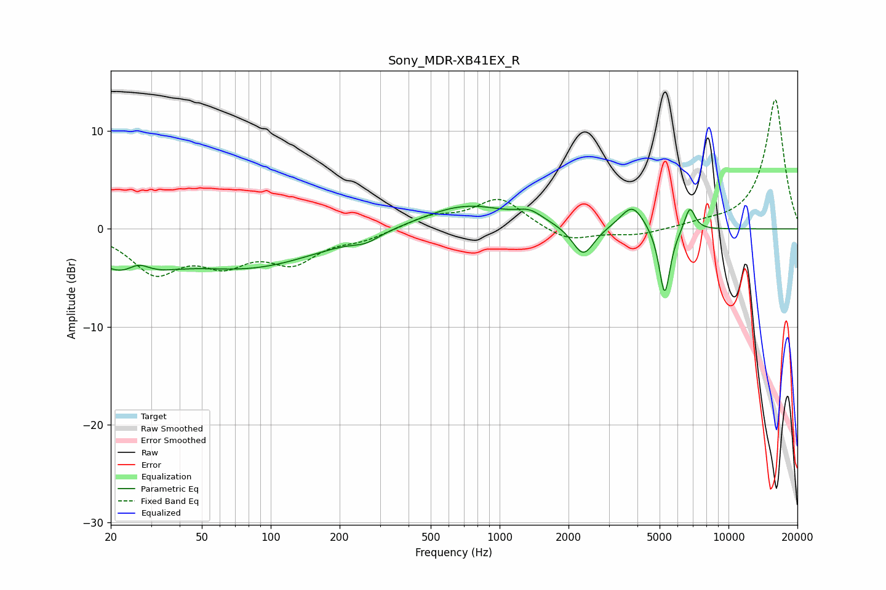

# Sony_MDR-XB41EX_R
See [usage instructions](https://github.com/jaakkopasanen/AutoEq#usage) for more options and info.

### Parametric EQs
Apply preamp of -2.4 dB when using parametric equalizer.

|   # | Type    |   Fc (Hz) |    Q |   Gain (dB) |
|-----|---------|-----------|------|-------------|
|   1 | Peaking |        24 | 0.97 |        -4.2 |
|   2 | Peaking |        26 | 2.58 |         1.7 |
|   3 | Peaking |        82 | 0.46 |        -3.7 |
|   4 | Peaking |       261 | 2.44 |        -0.7 |
|   5 | Peaking |       711 | 0.73 |         2.5 |
|   6 | Peaking |      1354 | 2.49 |         1   |
|   7 | Peaking |      2320 | 2.97 |        -3.1 |
|   8 | Peaking |      3802 | 2.71 |         2.5 |
|   9 | Peaking |      5262 | 5.63 |        -7.1 |
|  10 | Peaking |      6774 | 5.92 |         2.5 |

### Fixed Band EQs
When using fixed band (also called graphic) equalizer, apply preamp of **-13.3 dB** (if available) and set gains manually with these parameters.

|   # | Type    |   Fc (Hz) |    Q |   Gain (dB) |
|-----|---------|-----------|------|-------------|
|   1 | Peaking |        31 | 1.41 |        -4.2 |
|   2 | Peaking |        62 | 1.41 |        -2.9 |
|   3 | Peaking |       125 | 1.41 |        -3.1 |
|   4 | Peaking |       250 | 1.41 |        -0.9 |
|   5 | Peaking |       500 | 1.41 |         1.2 |
|   6 | Peaking |      1000 | 1.41 |         3.1 |
|   7 | Peaking |      2000 | 1.41 |        -1.4 |
|   8 | Peaking |      4000 | 1.41 |        -0.6 |
|   9 | Peaking |      8000 | 1.41 |         0.4 |
|  10 | Peaking |     16000 | 1.41 |        13.3 |

### Graphs

