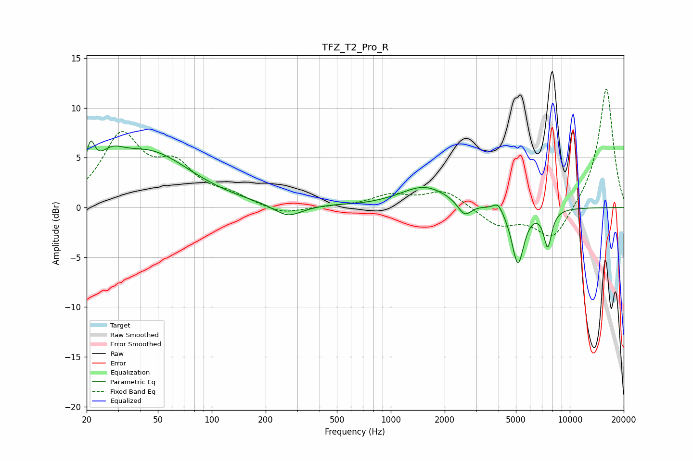

# TFZ_T2_Pro_R
See [usage instructions](https://github.com/jaakkopasanen/AutoEq#usage) for more options and info.

### Parametric EQs
Apply preamp of -6.8 dB when using parametric equalizer.

|   # | Type    |   Fc (Hz) |    Q |   Gain (dB) |
|-----|---------|-----------|------|-------------|
|   1 | Peaking |        21 | 5.93 |         3   |
|   2 | Peaking |        27 | 1.99 |         1.9 |
|   3 | Peaking |        44 | 0.6  |         5.4 |
|   4 | Peaking |       266 | 1.86 |        -1.2 |
|   5 | Peaking |       468 | 1.64 |         0.1 |
|   6 | Peaking |      1546 | 1.03 |         2.1 |
|   7 | Peaking |      2586 | 3.73 |        -1.4 |
|   8 | Peaking |      3979 | 5.29 |         1   |
|   9 | Peaking |      5128 | 4.1  |        -5.7 |
|  10 | Peaking |      7529 | 5.88 |        -3.7 |

### Fixed Band EQs
When using fixed band (also called graphic) equalizer, apply preamp of **-12.0 dB** (if available) and set gains manually with these parameters.

|   # | Type    |   Fc (Hz) |    Q |   Gain (dB) |
|-----|---------|-----------|------|-------------|
|   1 | Peaking |        31 | 1.41 |         6.9 |
|   2 | Peaking |        62 | 1.41 |         3.6 |
|   3 | Peaking |       125 | 1.41 |         1   |
|   4 | Peaking |       250 | 1.41 |        -0.8 |
|   5 | Peaking |       500 | 1.41 |         0.1 |
|   6 | Peaking |      1000 | 1.41 |         1.2 |
|   7 | Peaking |      2000 | 1.41 |         1.7 |
|   8 | Peaking |      4000 | 1.41 |        -1.8 |
|   9 | Peaking |      8000 | 1.41 |        -3.4 |
|  10 | Peaking |     16000 | 1.41 |        12.2 |

### Graphs

