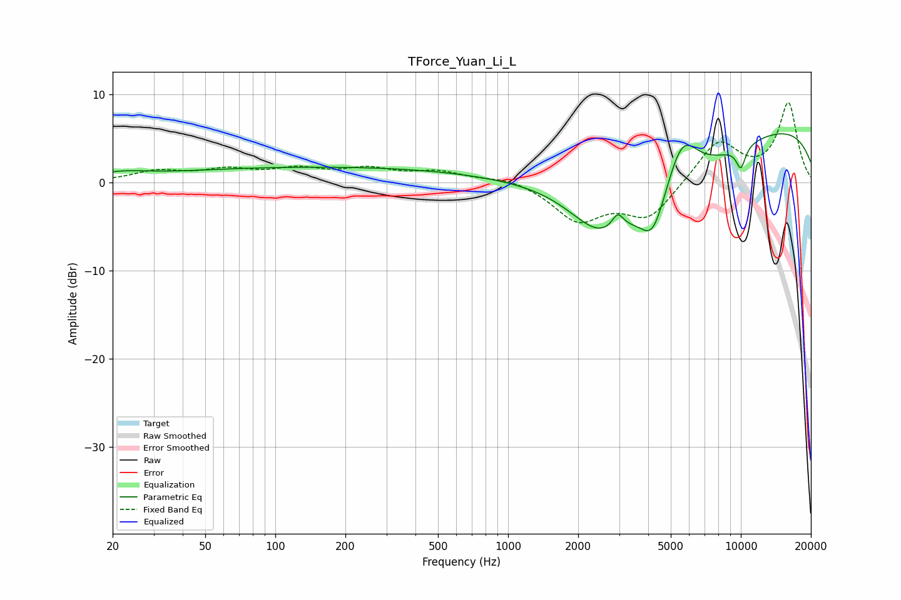

# TForce_Yuan_Li_L
See [usage instructions](https://github.com/jaakkopasanen/AutoEq#usage) for more options and info.

### Parametric EQs
Apply preamp of -5.6 dB when using parametric equalizer.

|   # | Type    |   Fc (Hz) |    Q |   Gain (dB) |
|-----|---------|-----------|------|-------------|
|   1 | Peaking |        21 | 1.12 |         0.7 |
|   2 | Peaking |       165 | 0.2  |         1.7 |
|   3 | Peaking |      2462 | 1.09 |        -4.6 |
|   4 | Peaking |      2957 | 5.74 |         1.7 |
|   5 | Peaking |      4187 | 2.65 |        -4.3 |
|   6 | Peaking |      4473 | 0.51 |        -7.9 |
|   7 | Peaking |      5580 | 1.88 |         6.5 |
|   8 | Peaking |      9614 | 0.18 |         3.4 |
|   9 | Peaking |     10000 | 0.18 |         3.7 |
|  10 | Peaking |     10000 | 5.85 |        -2.5 |

### Fixed Band EQs
When using fixed band (also called graphic) equalizer, apply preamp of **-9.1 dB** (if available) and set gains manually with these parameters.

|   # | Type    |   Fc (Hz) |    Q |   Gain (dB) |
|-----|---------|-----------|------|-------------|
|   1 | Peaking |        31 | 1.41 |         1.2 |
|   2 | Peaking |        62 | 1.41 |         1.2 |
|   3 | Peaking |       125 | 1.41 |         1.3 |
|   4 | Peaking |       250 | 1.41 |         1.3 |
|   5 | Peaking |       500 | 1.41 |         1.1 |
|   6 | Peaking |      1000 | 1.41 |         0.7 |
|   7 | Peaking |      2000 | 1.41 |        -4.2 |
|   8 | Peaking |      4000 | 1.41 |        -4   |
|   9 | Peaking |      8000 | 1.41 |         4.7 |
|  10 | Peaking |     16000 | 1.41 |         8.9 |

### Graphs

