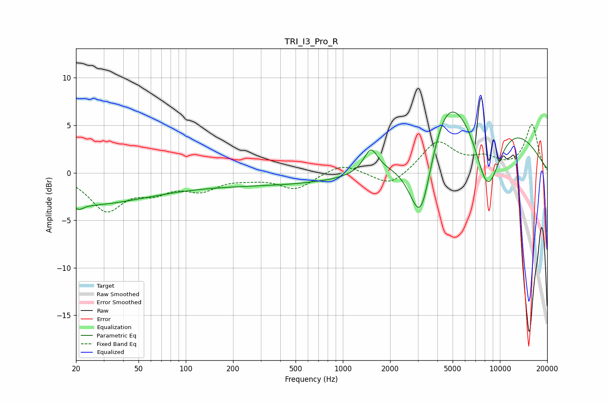

# TRI_I3_Pro_R
See [usage instructions](https://github.com/jaakkopasanen/AutoEq#usage) for more options and info.

### Parametric EQs
Apply preamp of -6.5 dB when using parametric equalizer.

|   # | Type    |   Fc (Hz) |    Q |   Gain (dB) |
|-----|---------|-----------|------|-------------|
|   1 | Peaking |        21 | 0.44 |        -1   |
|   2 | Peaking |        21 | 5.22 |        -0.5 |
|   3 | Peaking |        23 | 0.28 |        -2.3 |
|   4 | Peaking |       474 | 0.18 |        -1.3 |
|   5 | Peaking |       619 | 3.92 |         0   |
|   6 | Peaking |      1507 | 3.23 |         2.5 |
|   7 | Peaking |      3134 | 1.77 |        -9.8 |
|   8 | Peaking |      4468 | 1.15 |         4.4 |
|   9 | Peaking |      7543 | 0.4  |        10.1 |
|  10 | Peaking |      8325 | 1.24 |       -11.4 |

### Fixed Band EQs
When using fixed band (also called graphic) equalizer, apply preamp of **-5.2 dB** (if available) and set gains manually with these parameters.

|   # | Type    |   Fc (Hz) |    Q |   Gain (dB) |
|-----|---------|-----------|------|-------------|
|   1 | Peaking |        31 | 1.41 |        -3.8 |
|   2 | Peaking |        62 | 1.41 |        -1.6 |
|   3 | Peaking |       125 | 1.41 |        -1.6 |
|   4 | Peaking |       250 | 1.41 |        -0.4 |
|   5 | Peaking |       500 | 1.41 |        -1.7 |
|   6 | Peaking |      1000 | 1.41 |         1.1 |
|   7 | Peaking |      2000 | 1.41 |        -1.6 |
|   8 | Peaking |      4000 | 1.41 |         3.3 |
|   9 | Peaking |      8000 | 1.41 |         1.3 |
|  10 | Peaking |     16000 | 1.41 |         5   |

### Graphs

