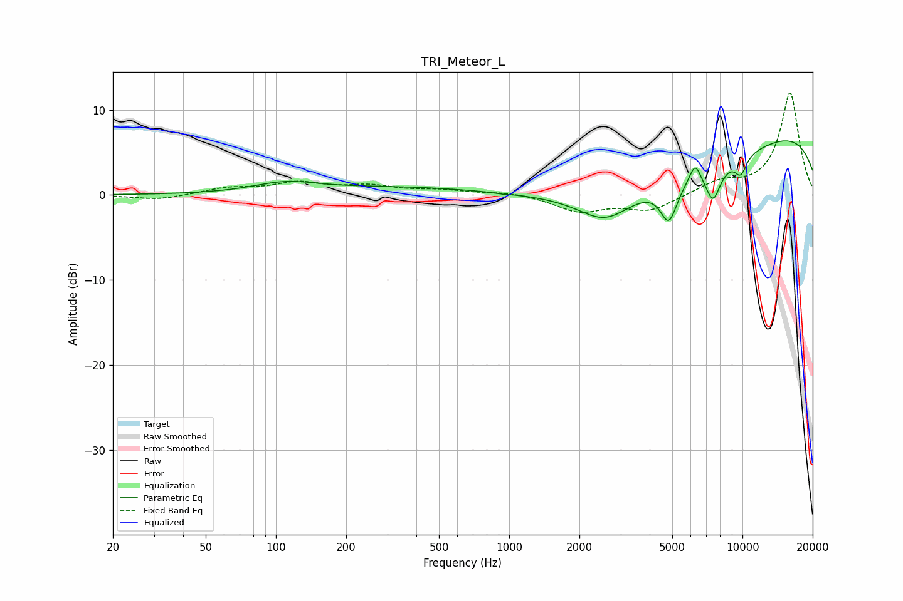

# TRI_Meteor_L
See [usage instructions](https://github.com/jaakkopasanen/AutoEq#usage) for more options and info.

### Parametric EQs
Apply preamp of -6.5 dB when using parametric equalizer.

|   # | Type    |   Fc (Hz) |    Q |   Gain (dB) |
|-----|---------|-----------|------|-------------|
|   1 | Peaking |       110 | 1.05 |         1.2 |
|   2 | Peaking |       694 | 0.21 |         1.2 |
|   3 | Peaking |       930 | 5.07 |        -0.1 |
|   4 | Peaking |      2581 | 1.2  |        -3.6 |
|   5 | Peaking |      4662 | 0.25 |        -8   |
|   6 | Peaking |      4834 | 3.85 |        -4.5 |
|   7 | Peaking |      6265 | 5.87 |         2.2 |
|   8 | Peaking |      7477 | 4.13 |        -3.9 |
|   9 | Peaking |      8849 | 0.18 |        11.1 |
|  10 | Peaking |      9829 | 4.91 |        -2.1 |

### Fixed Band EQs
When using fixed band (also called graphic) equalizer, apply preamp of **-12.1 dB** (if available) and set gains manually with these parameters.

|   # | Type    |   Fc (Hz) |    Q |   Gain (dB) |
|-----|---------|-----------|------|-------------|
|   1 | Peaking |        31 | 1.41 |        -0.6 |
|   2 | Peaking |        62 | 1.41 |         0.8 |
|   3 | Peaking |       125 | 1.41 |         1.3 |
|   4 | Peaking |       250 | 1.41 |         0.9 |
|   5 | Peaking |       500 | 1.41 |         0.5 |
|   6 | Peaking |      1000 | 1.41 |         0.4 |
|   7 | Peaking |      2000 | 1.41 |        -1.9 |
|   8 | Peaking |      4000 | 1.41 |        -1.8 |
|   9 | Peaking |      8000 | 1.41 |         1.4 |
|  10 | Peaking |     16000 | 1.41 |        12   |

### Graphs

