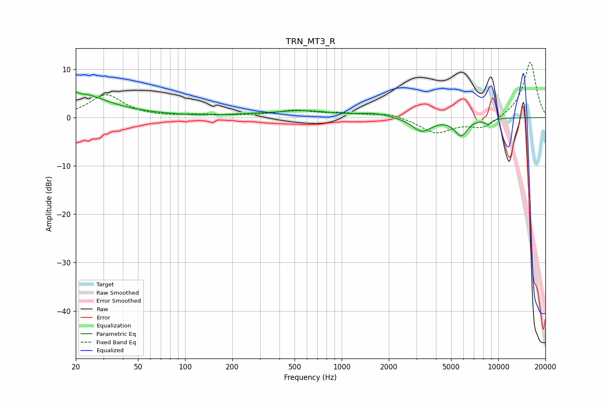

# TRN_MT3_R
See [usage instructions](https://github.com/jaakkopasanen/AutoEq#usage) for more options and info.

### Parametric EQs
Apply preamp of -5.3 dB when using parametric equalizer.

|   # | Type    |   Fc (Hz) |    Q |   Gain (dB) |
|-----|---------|-----------|------|-------------|
|   1 | Peaking |        21 | 5.58 |         3.4 |
|   2 | Peaking |        21 | 5.86 |        -2.9 |
|   3 | Peaking |        22 | 0.99 |         3.5 |
|   4 | Peaking |        22 | 0.32 |         1.2 |
|   5 | Peaking |       239 | 1.37 |         0.3 |
|   6 | Peaking |       557 | 0.76 |         1.4 |
|   7 | Peaking |      1629 | 1.45 |         0.8 |
|   8 | Peaking |      3250 | 2.27 |        -2.8 |
|   9 | Peaking |      5788 | 3.37 |        -3.5 |
|  10 | Peaking |      8598 | 5.54 |        -1   |

### Fixed Band EQs
When using fixed band (also called graphic) equalizer, apply preamp of **-11.5 dB** (if available) and set gains manually with these parameters.

|   # | Type    |   Fc (Hz) |    Q |   Gain (dB) |
|-----|---------|-----------|------|-------------|
|   1 | Peaking |        31 | 1.41 |         4.7 |
|   2 | Peaking |        62 | 1.41 |         0.1 |
|   3 | Peaking |       125 | 1.41 |         0.5 |
|   4 | Peaking |       250 | 1.41 |         0.3 |
|   5 | Peaking |       500 | 1.41 |         1.4 |
|   6 | Peaking |      1000 | 1.41 |         0.8 |
|   7 | Peaking |      2000 | 1.41 |         0.9 |
|   8 | Peaking |      4000 | 1.41 |        -3.2 |
|   9 | Peaking |      8000 | 1.41 |        -2.3 |
|  10 | Peaking |     16000 | 1.41 |        11.6 |

### Graphs

