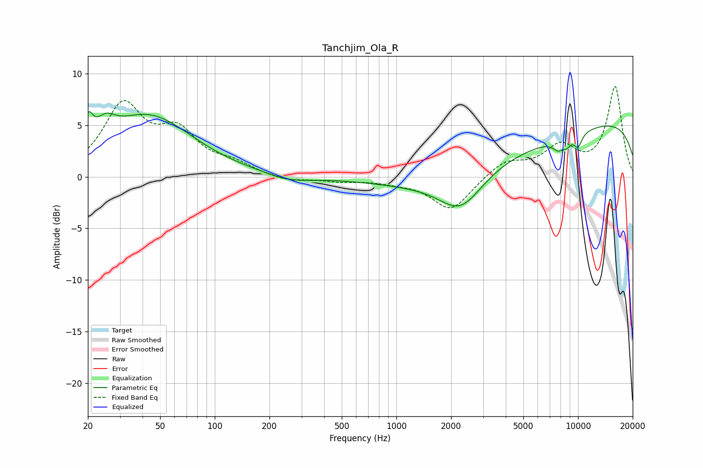

# Tanchjim_Ola_R
See [usage instructions](https://github.com/jaakkopasanen/AutoEq#usage) for more options and info.

### Parametric EQs
Apply preamp of -6.4 dB when using parametric equalizer.

|   # | Type    |   Fc (Hz) |    Q |   Gain (dB) |
|-----|---------|-----------|------|-------------|
|   1 | Peaking |        20 | 5.96 |         2.4 |
|   2 | Peaking |        25 | 2.64 |         1.8 |
|   3 | Peaking |        43 | 0.58 |         5.8 |
|   4 | Peaking |       260 | 1.17 |        -0.6 |
|   5 | Peaking |      2260 | 1.18 |        -3.6 |
|   6 | Peaking |      3734 | 0.25 |        -2.7 |
|   7 | Peaking |      7803 | 4.17 |        -1   |
|   8 | Peaking |      8685 | 5.82 |        -0.6 |
|   9 | Peaking |     10000 | 5.55 |        -1.3 |
|  10 | Peaking |     10000 | 0.18 |         6.2 |

### Fixed Band EQs
When using fixed band (also called graphic) equalizer, apply preamp of **-8.8 dB** (if available) and set gains manually with these parameters.

|   # | Type    |   Fc (Hz) |    Q |   Gain (dB) |
|-----|---------|-----------|------|-------------|
|   1 | Peaking |        31 | 1.41 |         6.6 |
|   2 | Peaking |        62 | 1.41 |         3.8 |
|   3 | Peaking |       125 | 1.41 |         1   |
|   4 | Peaking |       250 | 1.41 |        -0.5 |
|   5 | Peaking |       500 | 1.41 |        -0.4 |
|   6 | Peaking |      1000 | 1.41 |        -0.4 |
|   7 | Peaking |      2000 | 1.41 |        -3.3 |
|   8 | Peaking |      4000 | 1.41 |         1.5 |
|   9 | Peaking |      8000 | 1.41 |         2.7 |
|  10 | Peaking |     16000 | 1.41 |         8.7 |

### Graphs

