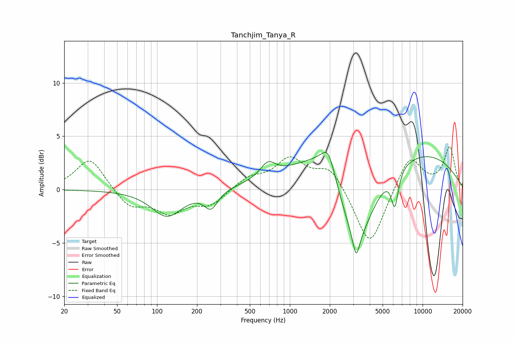

# Tanchjim_Tanya_R
See [usage instructions](https://github.com/jaakkopasanen/AutoEq#usage) for more options and info.

### Parametric EQs
Apply preamp of -3.6 dB when using parametric equalizer.

|   # | Type    |   Fc (Hz) |    Q |   Gain (dB) |
|-----|---------|-----------|------|-------------|
|   1 | Peaking |       119 | 1.24 |        -2.5 |
|   2 | Peaking |       255 | 2.75 |        -1.7 |
|   3 | Peaking |       683 | 2.54 |         1.3 |
|   4 | Peaking |      1398 | 3.89 |        -0   |
|   5 | Peaking |      1846 | 1.05 |         2.1 |
|   6 | Peaking |      1950 | 3.02 |         2   |
|   7 | Peaking |      3154 | 0.97 |        -9   |
|   8 | Peaking |      3161 | 5.84 |        -2.2 |
|   9 | Peaking |      4974 | 0.18 |         4.4 |
|  10 | Peaking |      6177 | 5.22 |        -3.3 |

### Fixed Band EQs
When using fixed band (also called graphic) equalizer, apply preamp of **-4.1 dB** (if available) and set gains manually with these parameters.

|   # | Type    |   Fc (Hz) |    Q |   Gain (dB) |
|-----|---------|-----------|------|-------------|
|   1 | Peaking |        31 | 1.41 |         3   |
|   2 | Peaking |        62 | 1.41 |        -1.7 |
|   3 | Peaking |       125 | 1.41 |        -2   |
|   4 | Peaking |       250 | 1.41 |        -1.4 |
|   5 | Peaking |       500 | 1.41 |         1.1 |
|   6 | Peaking |      1000 | 1.41 |         2.7 |
|   7 | Peaking |      2000 | 1.41 |         2.1 |
|   8 | Peaking |      4000 | 1.41 |        -5.5 |
|   9 | Peaking |      8000 | 1.41 |         3.3 |
|  10 | Peaking |     16000 | 1.41 |         3.9 |

### Graphs

