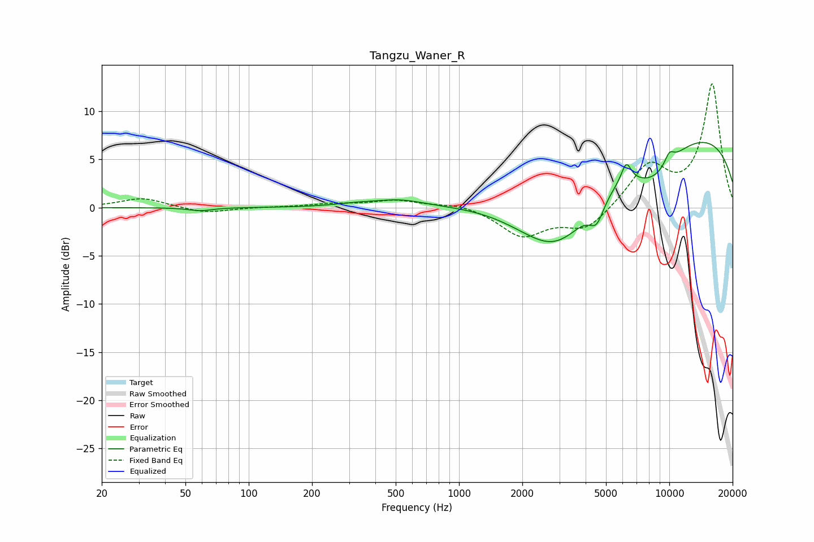

# Tangzu_Waner_R
See [usage instructions](https://github.com/jaakkopasanen/AutoEq#usage) for more options and info.

### Parametric EQs
Apply preamp of -6.9 dB when using parametric equalizer.

|   # | Type    |   Fc (Hz) |    Q |   Gain (dB) |
|-----|---------|-----------|------|-------------|
|   1 | Peaking |        59 | 2.49 |        -0.3 |
|   2 | Peaking |       318 | 1.48 |         0.3 |
|   3 | Peaking |       520 | 1.19 |         0.7 |
|   4 | Peaking |      2496 | 0.66 |        -2.4 |
|   5 | Peaking |      3025 | 0.78 |        -6.5 |
|   6 | Peaking |      4514 | 3.91 |        -2.3 |
|   7 | Peaking |      6239 | 5.78 |         2.1 |
|   8 | Peaking |      8395 | 1.07 |        -3.7 |
|   9 | Peaking |      9538 | 0.18 |         8.4 |
|  10 | Peaking |     10000 | 5.09 |         1.2 |

### Fixed Band EQs
When using fixed band (also called graphic) equalizer, apply preamp of **-12.9 dB** (if available) and set gains manually with these parameters.

|   # | Type    |   Fc (Hz) |    Q |   Gain (dB) |
|-----|---------|-----------|------|-------------|
|   1 | Peaking |        31 | 1.41 |         1   |
|   2 | Peaking |        62 | 1.41 |        -0.6 |
|   3 | Peaking |       125 | 1.41 |         0   |
|   4 | Peaking |       250 | 1.41 |         0.3 |
|   5 | Peaking |       500 | 1.41 |         0.7 |
|   6 | Peaking |      1000 | 1.41 |         0.5 |
|   7 | Peaking |      2000 | 1.41 |        -2.9 |
|   8 | Peaking |      4000 | 1.41 |        -2.3 |
|   9 | Peaking |      8000 | 1.41 |         4.2 |
|  10 | Peaking |     16000 | 1.41 |        12.7 |

### Graphs

