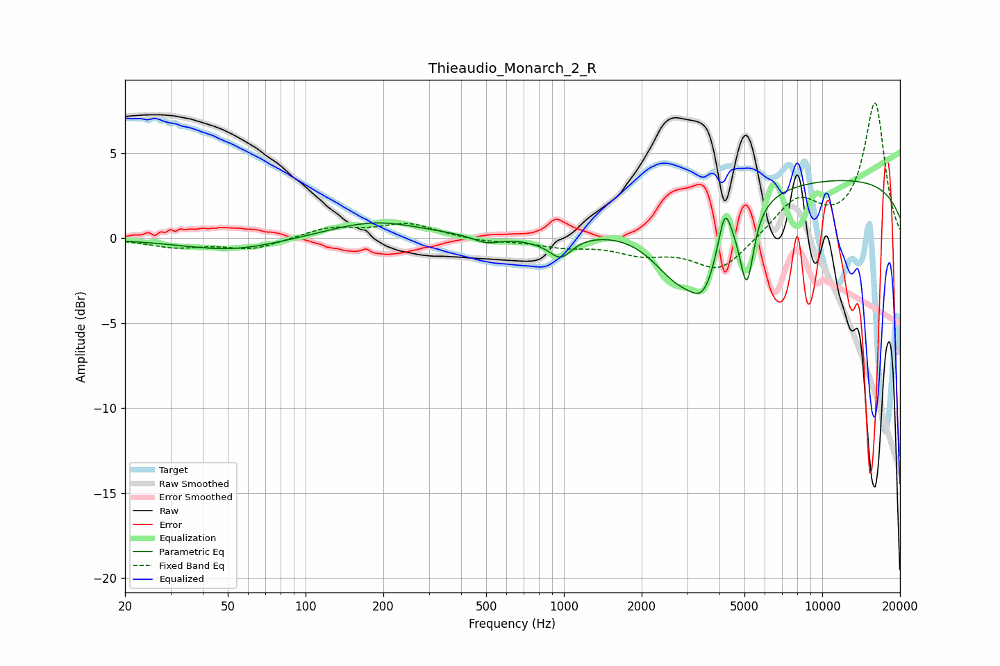

# Thieaudio_Monarch_2_R
See [usage instructions](https://github.com/jaakkopasanen/AutoEq#usage) for more options and info.

### Parametric EQs
Apply preamp of -3.5 dB when using parametric equalizer.

|   # | Type    |   Fc (Hz) |    Q |   Gain (dB) |
|-----|---------|-----------|------|-------------|
|   1 | Peaking |        52 | 0.73 |        -0.7 |
|   2 | Peaking |       184 | 0.77 |         1   |
|   3 | Peaking |       502 | 2.65 |        -0.4 |
|   4 | Peaking |       834 | 1.59 |        -0.3 |
|   5 | Peaking |       973 | 3.24 |        -1.1 |
|   6 | Peaking |      2791 | 1.28 |        -3.8 |
|   7 | Peaking |      3502 | 2.54 |        -2.9 |
|   8 | Peaking |      4195 | 5.97 |         2.2 |
|   9 | Peaking |      5104 | 5.22 |        -4.4 |
|  10 | Peaking |     10000 | 0.18 |         3.5 |

### Fixed Band EQs
When using fixed band (also called graphic) equalizer, apply preamp of **-8.0 dB** (if available) and set gains manually with these parameters.

|   # | Type    |   Fc (Hz) |    Q |   Gain (dB) |
|-----|---------|-----------|------|-------------|
|   1 | Peaking |        31 | 1.41 |        -0.5 |
|   2 | Peaking |        62 | 1.41 |        -0.6 |
|   3 | Peaking |       125 | 1.41 |         0.6 |
|   4 | Peaking |       250 | 1.41 |         0.8 |
|   5 | Peaking |       500 | 1.41 |        -0.2 |
|   6 | Peaking |      1000 | 1.41 |        -0.4 |
|   7 | Peaking |      2000 | 1.41 |        -0.8 |
|   8 | Peaking |      4000 | 1.41 |        -2   |
|   9 | Peaking |      8000 | 1.41 |         2.2 |
|  10 | Peaking |     16000 | 1.41 |         7.9 |

### Graphs

