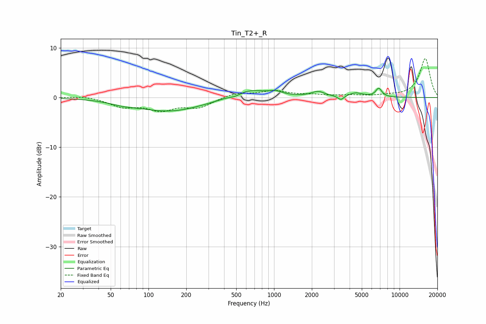

# Tin_T2+_R
See [usage instructions](https://github.com/jaakkopasanen/AutoEq#usage) for more options and info.

### Parametric EQs
Apply preamp of -1.9 dB when using parametric equalizer.

|   # | Type    |   Fc (Hz) |    Q |   Gain (dB) |
|-----|---------|-----------|------|-------------|
|   1 | Peaking |        62 | 1.48 |        -0.5 |
|   2 | Peaking |       149 | 0.53 |        -2.8 |
|   3 | Peaking |       346 | 1.34 |        -0.2 |
|   4 | Peaking |       492 | 2.76 |        -0.7 |
|   5 | Peaking |       593 | 0.92 |         2   |
|   6 | Peaking |      1032 | 2.75 |         0.7 |
|   7 | Peaking |      2240 | 2.72 |         1   |
|   8 | Peaking |      3408 | 6    |        -0.9 |
|   9 | Peaking |      4473 | 2.49 |         0.9 |
|  10 | Peaking |      6824 | 5.5  |         1.7 |

### Fixed Band EQs
When using fixed band (also called graphic) equalizer, apply preamp of **-7.9 dB** (if available) and set gains manually with these parameters.

|   # | Type    |   Fc (Hz) |    Q |   Gain (dB) |
|-----|---------|-----------|------|-------------|
|   1 | Peaking |        31 | 1.41 |         0.4 |
|   2 | Peaking |        62 | 1.41 |        -1.7 |
|   3 | Peaking |       125 | 1.41 |        -2.3 |
|   4 | Peaking |       250 | 1.41 |        -1.9 |
|   5 | Peaking |       500 | 1.41 |         0.9 |
|   6 | Peaking |      1000 | 1.41 |         1.3 |
|   7 | Peaking |      2000 | 1.41 |         0.4 |
|   8 | Peaking |      4000 | 1.41 |         0.3 |
|   9 | Peaking |      8000 | 1.41 |         0.3 |
|  10 | Peaking |     16000 | 1.41 |         7.9 |

### Graphs

