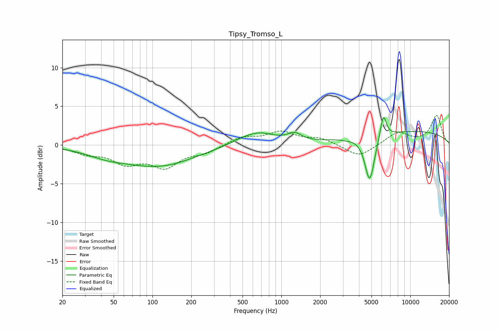

# Tipsy_Tromso_L
See [usage instructions](https://github.com/jaakkopasanen/AutoEq#usage) for more options and info.

### Parametric EQs
Apply preamp of -3.7 dB when using parametric equalizer.

|   # | Type    |   Fc (Hz) |    Q |   Gain (dB) |
|-----|---------|-----------|------|-------------|
|   1 | Peaking |        44 | 0.89 |        -0.9 |
|   2 | Peaking |       112 | 0.51 |        -2.6 |
|   3 | Peaking |       587 | 2.89 |        -0.1 |
|   4 | Peaking |       609 | 1.99 |        -0.1 |
|   5 | Peaking |       627 | 1.06 |         1.9 |
|   6 | Peaking |      1267 | 2.69 |         1   |
|   7 | Peaking |      3179 | 6    |        -0.1 |
|   8 | Peaking |      4843 | 3.75 |        -6   |
|   9 | Peaking |      6181 | 5.93 |         3.1 |
|  10 | Peaking |     10000 | 0.27 |         1.8 |

### Fixed Band EQs
When using fixed band (also called graphic) equalizer, apply preamp of **-3.9 dB** (if available) and set gains manually with these parameters.

|   # | Type    |   Fc (Hz) |    Q |   Gain (dB) |
|-----|---------|-----------|------|-------------|
|   1 | Peaking |        31 | 1.41 |        -0.9 |
|   2 | Peaking |        62 | 1.41 |        -2.1 |
|   3 | Peaking |       125 | 1.41 |        -2.6 |
|   4 | Peaking |       250 | 1.41 |        -0.9 |
|   5 | Peaking |       500 | 1.41 |         1   |
|   6 | Peaking |      1000 | 1.41 |         1.6 |
|   7 | Peaking |      2000 | 1.41 |         0.8 |
|   8 | Peaking |      4000 | 1.41 |        -1.6 |
|   9 | Peaking |      8000 | 1.41 |         1.6 |
|  10 | Peaking |     16000 | 1.41 |         3.8 |

### Graphs

