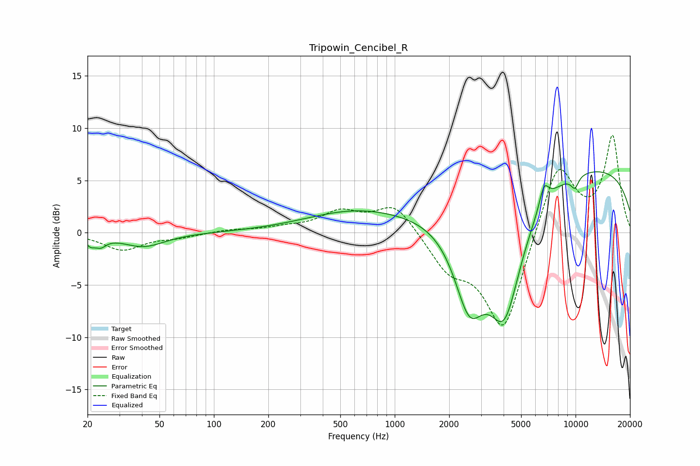

# Tripowin_Cencibel_R
See [usage instructions](https://github.com/jaakkopasanen/AutoEq#usage) for more options and info.

### Parametric EQs
Apply preamp of -5.9 dB when using parametric equalizer.

|   # | Type    |   Fc (Hz) |    Q |   Gain (dB) |
|-----|---------|-----------|------|-------------|
|   1 | Peaking |        21 | 5.65 |        -0.8 |
|   2 | Peaking |        24 | 4.56 |        -0.8 |
|   3 | Peaking |        41 | 1.19 |        -1.3 |
|   4 | Peaking |       606 | 0.51 |         2   |
|   5 | Peaking |      2585 | 1.62 |        -8.1 |
|   6 | Peaking |      4048 | 1.38 |       -11.4 |
|   7 | Peaking |      6691 | 5.14 |         2   |
|   8 | Peaking |      9561 | 5.87 |        -0.2 |
|   9 | Peaking |      9731 | 0.19 |         6.5 |
|  10 | Peaking |      9940 | 6    |        -1   |

### Fixed Band EQs
When using fixed band (also called graphic) equalizer, apply preamp of **-9.4 dB** (if available) and set gains manually with these parameters.

|   # | Type    |   Fc (Hz) |    Q |   Gain (dB) |
|-----|---------|-----------|------|-------------|
|   1 | Peaking |        31 | 1.41 |        -1.6 |
|   2 | Peaking |        62 | 1.41 |        -0.4 |
|   3 | Peaking |       125 | 1.41 |         0.3 |
|   4 | Peaking |       250 | 1.41 |         0.4 |
|   5 | Peaking |       500 | 1.41 |         1.8 |
|   6 | Peaking |      1000 | 1.41 |         2.8 |
|   7 | Peaking |      2000 | 1.41 |        -3.1 |
|   8 | Peaking |      4000 | 1.41 |        -9.5 |
|   9 | Peaking |      8000 | 1.41 |         7   |
|  10 | Peaking |     16000 | 1.41 |         9.1 |

### Graphs

