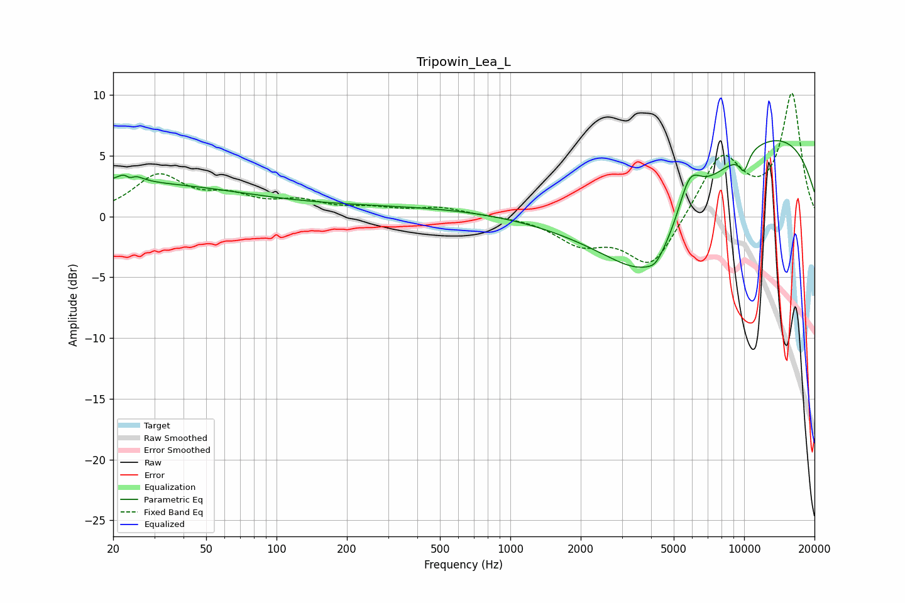

# Tripowin_Lea_L
See [usage instructions](https://github.com/jaakkopasanen/AutoEq#usage) for more options and info.

### Parametric EQs
Apply preamp of -6.3 dB when using parametric equalizer.

|   # | Type    |   Fc (Hz) |    Q |   Gain (dB) |
|-----|---------|-----------|------|-------------|
|   1 | Peaking |        20 | 0.24 |         2.7 |
|   2 | Peaking |        23 | 4.78 |         3.1 |
|   3 | Peaking |        24 | 5.98 |        -2.6 |
|   4 | Peaking |       616 | 0.18 |         0.9 |
|   5 | Peaking |      3448 | 0.44 |        -6.7 |
|   6 | Peaking |      4048 | 0.91 |        -4.4 |
|   7 | Peaking |      4182 | 4.4  |        -0.6 |
|   8 | Peaking |      5837 | 2.73 |         3.4 |
|   9 | Peaking |      9257 | 0.21 |         8.1 |
|  10 | Peaking |     10000 | 5.79 |        -1.5 |

### Fixed Band EQs
When using fixed band (also called graphic) equalizer, apply preamp of **-10.2 dB** (if available) and set gains manually with these parameters.

|   # | Type    |   Fc (Hz) |    Q |   Gain (dB) |
|-----|---------|-----------|------|-------------|
|   1 | Peaking |        31 | 1.41 |         3.2 |
|   2 | Peaking |        62 | 1.41 |         1.3 |
|   3 | Peaking |       125 | 1.41 |         1   |
|   4 | Peaking |       250 | 1.41 |         0.5 |
|   5 | Peaking |       500 | 1.41 |         0.7 |
|   6 | Peaking |      1000 | 1.41 |         0   |
|   7 | Peaking |      2000 | 1.41 |        -2   |
|   8 | Peaking |      4000 | 1.41 |        -4.2 |
|   9 | Peaking |      8000 | 1.41 |         5.1 |
|  10 | Peaking |     16000 | 1.41 |        10   |

### Graphs

