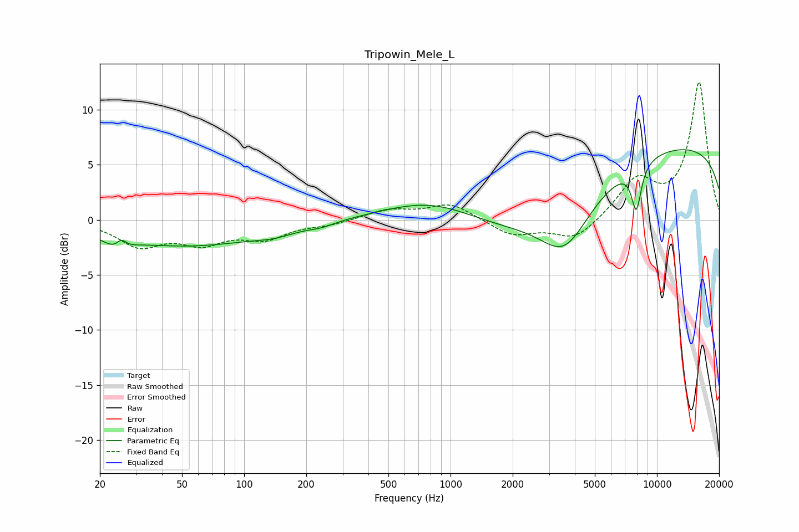

# Tripowin_Mele_L
See [usage instructions](https://github.com/jaakkopasanen/AutoEq#usage) for more options and info.

### Parametric EQs
Apply preamp of -6.5 dB when using parametric equalizer.

|   # | Type    |   Fc (Hz) |    Q |   Gain (dB) |
|-----|---------|-----------|------|-------------|
|   1 | Peaking |        24 | 2.42 |        -1.1 |
|   2 | Peaking |        25 | 6    |         0.9 |
|   3 | Peaking |        53 | 0.38 |        -2.3 |
|   4 | Peaking |       140 | 1.5  |        -0.5 |
|   5 | Peaking |       235 | 2.28 |        -0.3 |
|   6 | Peaking |       850 | 0.56 |         3.5 |
|   7 | Peaking |      3581 | 1.2  |        -4.4 |
|   8 | Peaking |      4914 | 0.18 |        -9.4 |
|   9 | Peaking |      7947 | 5.5  |        -4.1 |
|  10 | Peaking |      8870 | 0.21 |        14.6 |

### Fixed Band EQs
When using fixed band (also called graphic) equalizer, apply preamp of **-12.6 dB** (if available) and set gains manually with these parameters.

|   # | Type    |   Fc (Hz) |    Q |   Gain (dB) |
|-----|---------|-----------|------|-------------|
|   1 | Peaking |        31 | 1.41 |        -2.2 |
|   2 | Peaking |        62 | 1.41 |        -1.8 |
|   3 | Peaking |       125 | 1.41 |        -1.5 |
|   4 | Peaking |       250 | 1.41 |        -0.4 |
|   5 | Peaking |       500 | 1.41 |         0.9 |
|   6 | Peaking |      1000 | 1.41 |         1.5 |
|   7 | Peaking |      2000 | 1.41 |        -1.4 |
|   8 | Peaking |      4000 | 1.41 |        -1.9 |
|   9 | Peaking |      8000 | 1.41 |         3.5 |
|  10 | Peaking |     16000 | 1.41 |        12.4 |

### Graphs

