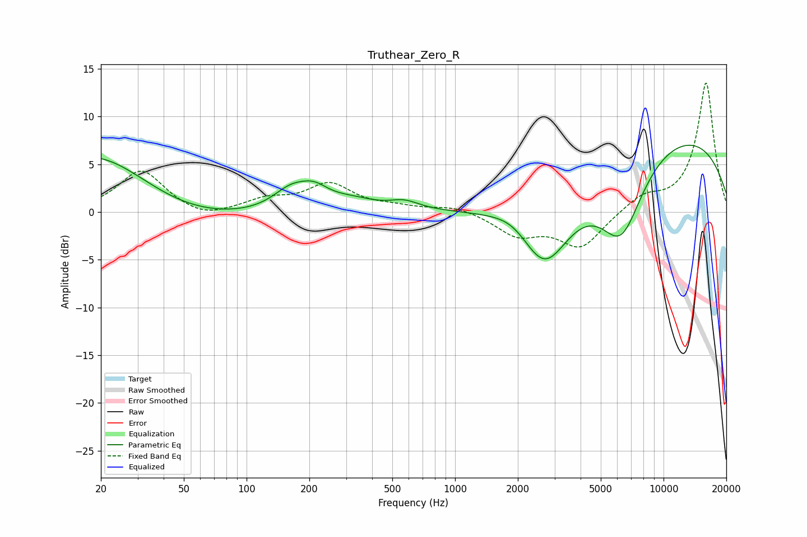

# Truthear_Zero_R
See [usage instructions](https://github.com/jaakkopasanen/AutoEq#usage) for more options and info.

### Parametric EQs
Apply preamp of -7.1 dB when using parametric equalizer.

|   # | Type    |   Fc (Hz) |    Q |   Gain (dB) |
|-----|---------|-----------|------|-------------|
|   1 | Peaking |        20 | 0.48 |         7.8 |
|   2 | Peaking |        39 | 0.43 |        -3   |
|   3 | Peaking |       163 | 1.62 |         2.1 |
|   4 | Peaking |       211 | 2.01 |         1.6 |
|   5 | Peaking |       321 | 1.21 |         1   |
|   6 | Peaking |       572 | 2.01 |         0.9 |
|   7 | Peaking |      1939 | 1.37 |         1.5 |
|   8 | Peaking |      2683 | 1.08 |        -8.6 |
|   9 | Peaking |      6265 | 1.23 |        -8.6 |
|  10 | Peaking |     10000 | 0.25 |         8.6 |

### Fixed Band EQs
When using fixed band (also called graphic) equalizer, apply preamp of **-13.6 dB** (if available) and set gains manually with these parameters.

|   # | Type    |   Fc (Hz) |    Q |   Gain (dB) |
|-----|---------|-----------|------|-------------|
|   1 | Peaking |        31 | 1.41 |         4.4 |
|   2 | Peaking |        62 | 1.41 |        -0.9 |
|   3 | Peaking |       125 | 1.41 |         1.2 |
|   4 | Peaking |       250 | 1.41 |         2.8 |
|   5 | Peaking |       500 | 1.41 |         0.4 |
|   6 | Peaking |      1000 | 1.41 |         0.7 |
|   7 | Peaking |      2000 | 1.41 |        -2.3 |
|   8 | Peaking |      4000 | 1.41 |        -3.7 |
|   9 | Peaking |      8000 | 1.41 |         1.5 |
|  10 | Peaking |     16000 | 1.41 |        13.6 |

### Graphs

