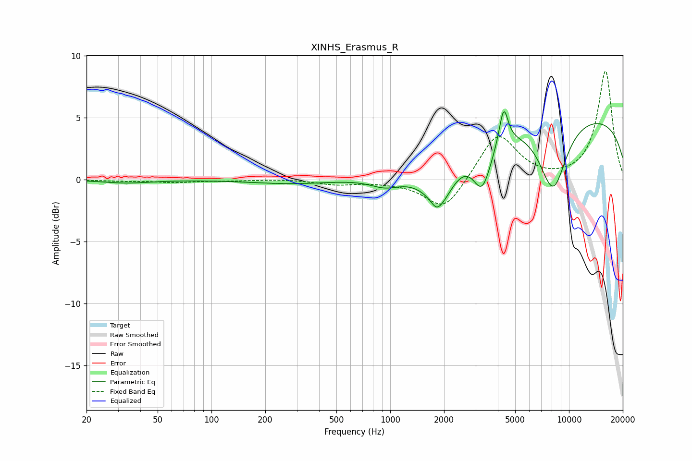

# XINHS_Erasmus_R
See [usage instructions](https://github.com/jaakkopasanen/AutoEq#usage) for more options and info.

### Parametric EQs
Apply preamp of -5.6 dB when using parametric equalizer.

|   # | Type    |   Fc (Hz) |    Q |   Gain (dB) |
|-----|---------|-----------|------|-------------|
|   1 | Peaking |        33 | 1.1  |        -0.3 |
|   2 | Peaking |       283 | 0.64 |        -0.3 |
|   3 | Peaking |       943 | 1.6  |        -0.8 |
|   4 | Peaking |      1572 | 1.18 |        -0.7 |
|   5 | Peaking |      1817 | 5.01 |        -0.6 |
|   6 | Peaking |      1918 | 1.85 |        -2.9 |
|   7 | Peaking |      3272 | 2.76 |        -3.5 |
|   8 | Peaking |      4312 | 5.75 |         3   |
|   9 | Peaking |      8140 | 1.69 |        -5.7 |
|  10 | Peaking |      9816 | 0.18 |         5.3 |

### Fixed Band EQs
When using fixed band (also called graphic) equalizer, apply preamp of **-8.8 dB** (if available) and set gains manually with these parameters.

|   # | Type    |   Fc (Hz) |    Q |   Gain (dB) |
|-----|---------|-----------|------|-------------|
|   1 | Peaking |        31 | 1.41 |        -0.1 |
|   2 | Peaking |        62 | 1.41 |        -0.2 |
|   3 | Peaking |       125 | 1.41 |        -0.1 |
|   4 | Peaking |       250 | 1.41 |         0.1 |
|   5 | Peaking |       500 | 1.41 |        -0.4 |
|   6 | Peaking |      1000 | 1.41 |        -0.1 |
|   7 | Peaking |      2000 | 1.41 |        -2.6 |
|   8 | Peaking |      4000 | 1.41 |         3.8 |
|   9 | Peaking |      8000 | 1.41 |        -0.1 |
|  10 | Peaking |     16000 | 1.41 |         8.8 |

### Graphs

