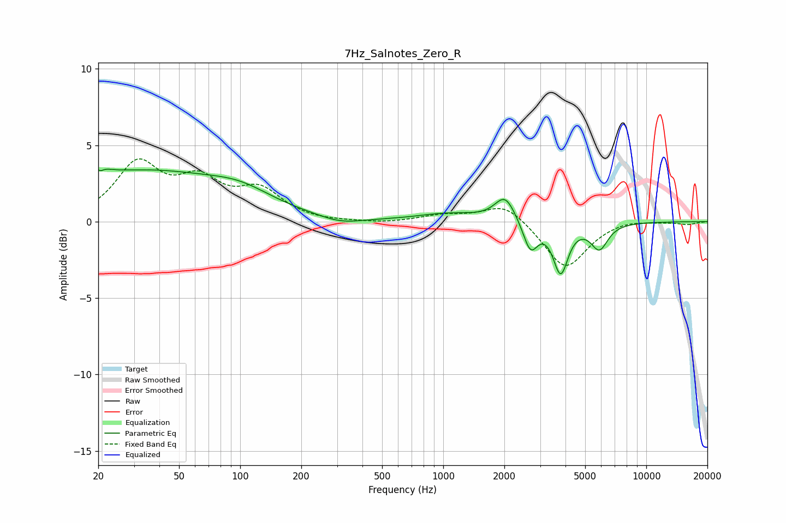

# 7Hz_Salnotes_Zero_R
See [usage instructions](https://github.com/jaakkopasanen/AutoEq#usage) for more options and info.

### Parametric EQs
Apply preamp of -3.5 dB when using parametric equalizer.

|   # | Type    |   Fc (Hz) |    Q |   Gain (dB) |
|-----|---------|-----------|------|-------------|
|   1 | Peaking |        20 | 5.02 |         2.9 |
|   2 | Peaking |        20 | 5.99 |        -2.6 |
|   3 | Peaking |        31 | 0.31 |         3.2 |
|   4 | Peaking |       101 | 0.91 |         0.9 |
|   5 | Peaking |       312 | 1.37 |        -0.4 |
|   6 | Peaking |      1072 | 0.92 |         0.5 |
|   7 | Peaking |      2017 | 2.83 |         1.6 |
|   8 | Peaking |      2689 | 3.97 |        -1.9 |
|   9 | Peaking |      3787 | 3.9  |        -3.2 |
|  10 | Peaking |      5876 | 3.3  |        -1.7 |

### Fixed Band EQs
When using fixed band (also called graphic) equalizer, apply preamp of **-4.2 dB** (if available) and set gains manually with these parameters.

|   # | Type    |   Fc (Hz) |    Q |   Gain (dB) |
|-----|---------|-----------|------|-------------|
|   1 | Peaking |        31 | 1.41 |         3.6 |
|   2 | Peaking |        62 | 1.41 |         2.3 |
|   3 | Peaking |       125 | 1.41 |         1.9 |
|   4 | Peaking |       250 | 1.41 |        -0.1 |
|   5 | Peaking |       500 | 1.41 |        -0.1 |
|   6 | Peaking |      1000 | 1.41 |         0.4 |
|   7 | Peaking |      2000 | 1.41 |         1.3 |
|   8 | Peaking |      4000 | 1.41 |        -3.1 |
|   9 | Peaking |      8000 | 1.41 |         0.2 |
|  10 | Peaking |     16000 | 1.41 |        -0.2 |

### Graphs

