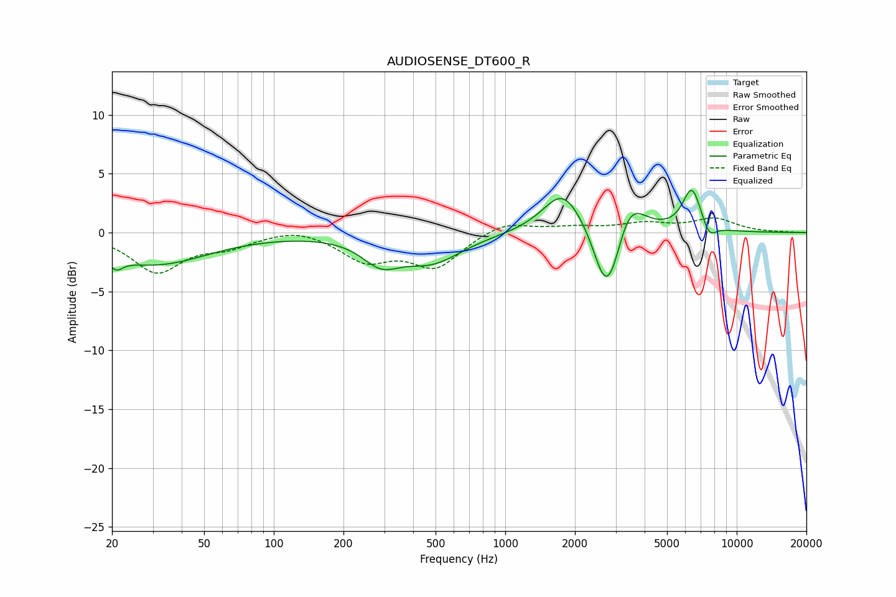

# AUDIOSENSE_DT600_R
See [usage instructions](https://github.com/jaakkopasanen/AutoEq#usage) for more options and info.

### Parametric EQs
Apply preamp of -3.7 dB when using parametric equalizer.

|   # | Type    |   Fc (Hz) |    Q |   Gain (dB) |
|-----|---------|-----------|------|-------------|
|   1 | Peaking |        21 | 4.88 |        -1   |
|   2 | Peaking |        30 | 0.61 |        -2.7 |
|   3 | Peaking |       290 | 1.73 |        -2   |
|   4 | Peaking |       482 | 1.07 |        -2.3 |
|   5 | Peaking |      1772 | 1.65 |         3.6 |
|   6 | Peaking |      2682 | 2.76 |        -4.5 |
|   7 | Peaking |      2913 | 3.24 |        -2.1 |
|   8 | Peaking |      3442 | 2.17 |         2.9 |
|   9 | Peaking |      6400 | 3.43 |         3.7 |
|  10 | Peaking |      7610 | 4.51 |        -1.2 |

### Fixed Band EQs
When using fixed band (also called graphic) equalizer, apply preamp of **-1.3 dB** (if available) and set gains manually with these parameters.

|   # | Type    |   Fc (Hz) |    Q |   Gain (dB) |
|-----|---------|-----------|------|-------------|
|   1 | Peaking |        31 | 1.41 |        -3.3 |
|   2 | Peaking |        62 | 1.41 |        -1   |
|   3 | Peaking |       125 | 1.41 |         0.5 |
|   4 | Peaking |       250 | 1.41 |        -2.2 |
|   5 | Peaking |       500 | 1.41 |        -2.8 |
|   6 | Peaking |      1000 | 1.41 |         1   |
|   7 | Peaking |      2000 | 1.41 |         0.4 |
|   8 | Peaking |      4000 | 1.41 |         0.7 |
|   9 | Peaking |      8000 | 1.41 |         1.1 |
|  10 | Peaking |     16000 | 1.41 |         0   |

### Graphs

