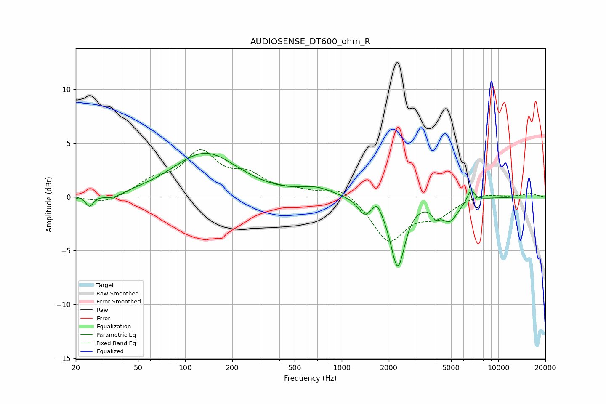

# AUDIOSENSE_DT600_ohm_R
See [usage instructions](https://github.com/jaakkopasanen/AutoEq#usage) for more options and info.

### Parametric EQs
Apply preamp of -4.1 dB when using parametric equalizer.

|   # | Type    |   Fc (Hz) |    Q |   Gain (dB) |
|-----|---------|-----------|------|-------------|
|   1 | Peaking |        24 | 5.86 |        -1   |
|   2 | Peaking |        35 | 2.37 |        -0.5 |
|   3 | Peaking |       134 | 0.69 |         4   |
|   4 | Peaking |       690 | 1.4  |         0.7 |
|   5 | Peaking |      1396 | 3.52 |        -1.3 |
|   6 | Peaking |      1681 | 5.89 |         0.9 |
|   7 | Peaking |      2278 | 3.13 |        -6.4 |
|   8 | Peaking |      3994 | 6    |        -0.9 |
|   9 | Peaking |      4888 | 2.48 |        -2   |
|  10 | Peaking |      6683 | 6    |         1.1 |

### Fixed Band EQs
When using fixed band (also called graphic) equalizer, apply preamp of **-4.5 dB** (if available) and set gains manually with these parameters.

|   # | Type    |   Fc (Hz) |    Q |   Gain (dB) |
|-----|---------|-----------|------|-------------|
|   1 | Peaking |        31 | 1.41 |        -0.7 |
|   2 | Peaking |        62 | 1.41 |         1.3 |
|   3 | Peaking |       125 | 1.41 |         3.9 |
|   4 | Peaking |       250 | 1.41 |         1.7 |
|   5 | Peaking |       500 | 1.41 |         0.4 |
|   6 | Peaking |      1000 | 1.41 |         1   |
|   7 | Peaking |      2000 | 1.41 |        -4.1 |
|   8 | Peaking |      4000 | 1.41 |        -1.6 |
|   9 | Peaking |      8000 | 1.41 |         0.4 |
|  10 | Peaking |     16000 | 1.41 |         0.3 |

### Graphs

