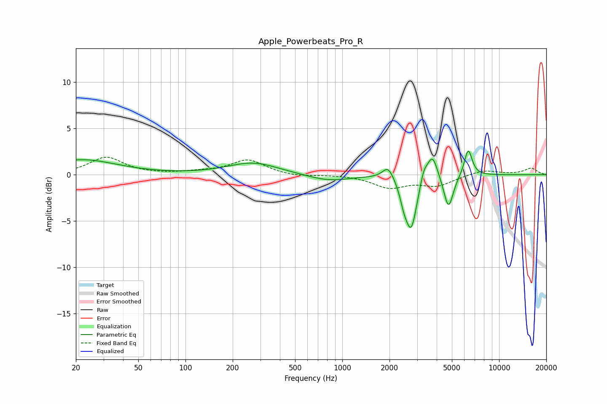

# Apple_Powerbeats_Pro_R
See [usage instructions](https://github.com/jaakkopasanen/AutoEq#usage) for more options and info.

### Parametric EQs
Apply preamp of -2.7 dB when using parametric equalizer.

|   # | Type    |   Fc (Hz) |    Q |   Gain (dB) |
|-----|---------|-----------|------|-------------|
|   1 | Peaking |        22 | 0.62 |         1.6 |
|   2 | Peaking |       270 | 0.87 |         1.3 |
|   3 | Peaking |       816 | 1.04 |        -0.7 |
|   4 | Peaking |      1961 | 4    |         1.4 |
|   5 | Peaking |      2467 | 5.92 |        -1.3 |
|   6 | Peaking |      2749 | 3.81 |        -5.7 |
|   7 | Peaking |      3310 | 6    |         1.3 |
|   8 | Peaking |      3757 | 4.29 |         2.7 |
|   9 | Peaking |      4759 | 4.62 |        -3.7 |
|  10 | Peaking |      6355 | 5.53 |         2.9 |

### Fixed Band EQs
When using fixed band (also called graphic) equalizer, apply preamp of **-2.0 dB** (if available) and set gains manually with these parameters.

|   # | Type    |   Fc (Hz) |    Q |   Gain (dB) |
|-----|---------|-----------|------|-------------|
|   1 | Peaking |        31 | 1.41 |         1.9 |
|   2 | Peaking |        62 | 1.41 |         0   |
|   3 | Peaking |       125 | 1.41 |         0.2 |
|   4 | Peaking |       250 | 1.41 |         1.6 |
|   5 | Peaking |       500 | 1.41 |        -0.2 |
|   6 | Peaking |      1000 | 1.41 |         0   |
|   7 | Peaking |      2000 | 1.41 |        -1.3 |
|   8 | Peaking |      4000 | 1.41 |        -1.1 |
|   9 | Peaking |      8000 | 1.41 |         0.5 |
|  10 | Peaking |     16000 | 1.41 |         0.7 |

### Graphs

