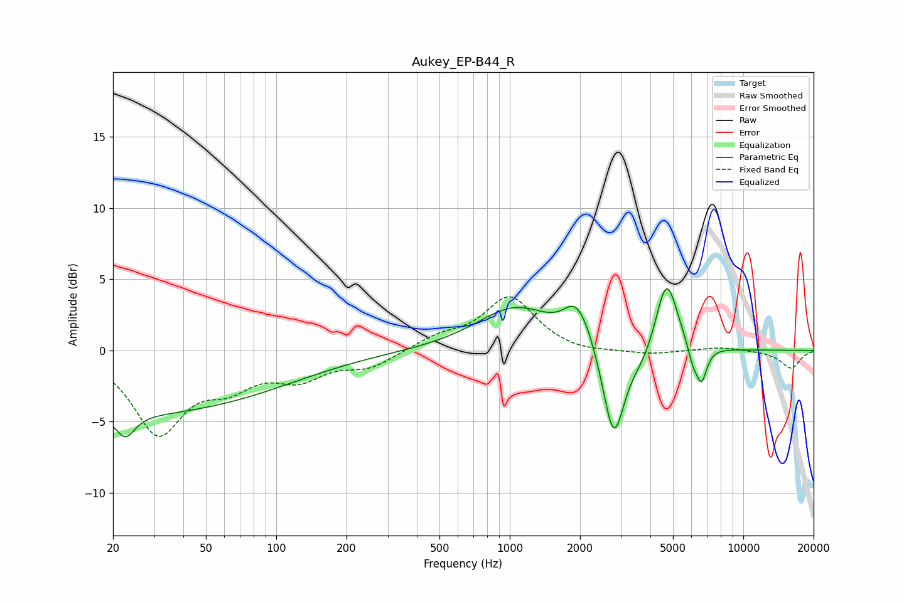

# Aukey_EP-B44_R
See [usage instructions](https://github.com/jaakkopasanen/AutoEq#usage) for more options and info.

### Parametric EQs
Apply preamp of -4.4 dB when using parametric equalizer.

|   # | Type    |   Fc (Hz) |    Q |   Gain (dB) |
|-----|---------|-----------|------|-------------|
|   1 | Peaking |        21 | 0.18 |        -4.5 |
|   2 | Peaking |        23 | 3.67 |        -1.6 |
|   3 | Peaking |      1060 | 0.85 |         3   |
|   4 | Peaking |      1900 | 2.76 |         2.1 |
|   5 | Peaking |      2137 | 3.08 |         0.8 |
|   6 | Peaking |      2787 | 3.07 |        -6.6 |
|   7 | Peaking |      3769 | 2.09 |        -1.3 |
|   8 | Peaking |      4685 | 2.9  |         5.4 |
|   9 | Peaking |      6087 | 5.98 |        -1.3 |
|  10 | Peaking |      6628 | 5.83 |        -2.4 |

### Fixed Band EQs
When using fixed band (also called graphic) equalizer, apply preamp of **-3.9 dB** (if available) and set gains manually with these parameters.

|   # | Type    |   Fc (Hz) |    Q |   Gain (dB) |
|-----|---------|-----------|------|-------------|
|   1 | Peaking |        31 | 1.41 |        -5.6 |
|   2 | Peaking |        62 | 1.41 |        -1.9 |
|   3 | Peaking |       125 | 1.41 |        -1.7 |
|   4 | Peaking |       250 | 1.41 |        -1.1 |
|   5 | Peaking |       500 | 1.41 |         0.8 |
|   6 | Peaking |      1000 | 1.41 |         3.7 |
|   7 | Peaking |      2000 | 1.41 |        -0.3 |
|   8 | Peaking |      4000 | 1.41 |        -0.3 |
|   9 | Peaking |      8000 | 1.41 |         0.2 |
|  10 | Peaking |     16000 | 1.41 |        -1.3 |

### Graphs

