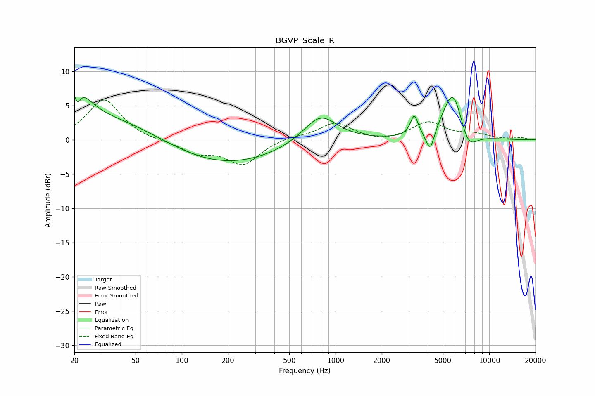

# BGVP_Scale_R
See [usage instructions](https://github.com/jaakkopasanen/AutoEq#usage) for more options and info.

### Parametric EQs
Apply preamp of -6.6 dB when using parametric equalizer.

|   # | Type    |   Fc (Hz) |    Q |   Gain (dB) |
|-----|---------|-----------|------|-------------|
|   1 | Peaking |        20 | 1.76 |         6.8 |
|   2 | Peaking |        21 | 5.82 |        -6.3 |
|   3 | Peaking |        21 | 5.86 |         3.2 |
|   4 | Peaking |        38 | 0.45 |         3.2 |
|   5 | Peaking |       181 | 0.38 |        -3.8 |
|   6 | Peaking |       794 | 1.27 |         4.2 |
|   7 | Peaking |      3253 | 5.81 |         3   |
|   8 | Peaking |      4131 | 4.99 |        -3.4 |
|   9 | Peaking |      5820 | 2.01 |         7.7 |
|  10 | Peaking |      7269 | 2.33 |        -3.4 |

### Fixed Band EQs
When using fixed band (also called graphic) equalizer, apply preamp of **-5.9 dB** (if available) and set gains manually with these parameters.

|   # | Type    |   Fc (Hz) |    Q |   Gain (dB) |
|-----|---------|-----------|------|-------------|
|   1 | Peaking |        31 | 1.41 |         5.9 |
|   2 | Peaking |        62 | 1.41 |        -0.1 |
|   3 | Peaking |       125 | 1.41 |        -1.7 |
|   4 | Peaking |       250 | 1.41 |        -3.5 |
|   5 | Peaking |       500 | 1.41 |         0.5 |
|   6 | Peaking |      1000 | 1.41 |         2.5 |
|   7 | Peaking |      2000 | 1.41 |        -0.4 |
|   8 | Peaking |      4000 | 1.41 |         2.5 |
|   9 | Peaking |      8000 | 1.41 |         0.7 |
|  10 | Peaking |     16000 | 1.41 |         0.3 |

### Graphs

