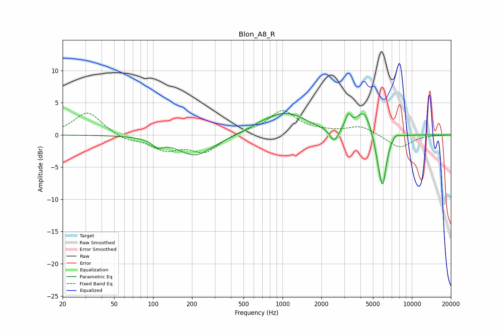

# Blon_A8_R
See [usage instructions](https://github.com/jaakkopasanen/AutoEq#usage) for more options and info.

### Parametric EQs
Apply preamp of -3.4 dB when using parametric equalizer.

|   # | Type    |   Fc (Hz) |    Q |   Gain (dB) |
|-----|---------|-----------|------|-------------|
|   1 | Peaking |       109 | 3.56 |        -1.1 |
|   2 | Peaking |       211 | 1.03 |        -3.2 |
|   3 | Peaking |       695 | 1.44 |         0.7 |
|   4 | Peaking |      1087 | 0.92 |         3.2 |
|   5 | Peaking |      2509 | 4.33 |        -2.1 |
|   6 | Peaking |      3220 | 6    |         2.1 |
|   7 | Peaking |      4280 | 2.29 |         3.9 |
|   8 | Peaking |      5470 | 3.65 |        -2.2 |
|   9 | Peaking |      5933 | 4.79 |        -7.4 |
|  10 | Peaking |      7518 | 5.59 |         0.6 |

### Fixed Band EQs
When using fixed band (also called graphic) equalizer, apply preamp of **-3.9 dB** (if available) and set gains manually with these parameters.

|   # | Type    |   Fc (Hz) |    Q |   Gain (dB) |
|-----|---------|-----------|------|-------------|
|   1 | Peaking |        31 | 1.41 |         3.6 |
|   2 | Peaking |        62 | 1.41 |        -0.8 |
|   3 | Peaking |       125 | 1.41 |        -2.1 |
|   4 | Peaking |       250 | 1.41 |        -2.6 |
|   5 | Peaking |       500 | 1.41 |         0.5 |
|   6 | Peaking |      1000 | 1.41 |         3.7 |
|   7 | Peaking |      2000 | 1.41 |         0.3 |
|   8 | Peaking |      4000 | 1.41 |         1.4 |
|   9 | Peaking |      8000 | 1.41 |        -2   |
|  10 | Peaking |     16000 | 1.41 |        -0   |

### Graphs

