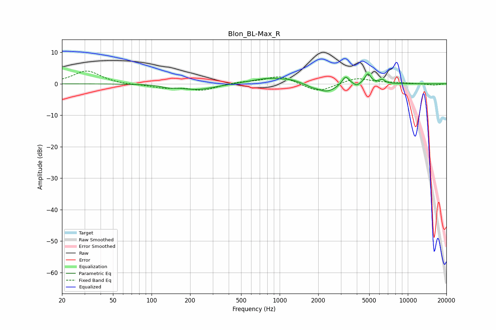

# Blon_BL-Max_R
See [usage instructions](https://github.com/jaakkopasanen/AutoEq#usage) for more options and info.

### Parametric EQs
Apply preamp of -3.2 dB when using parametric equalizer.

|   # | Type    |   Fc (Hz) |    Q |   Gain (dB) |
|-----|---------|-----------|------|-------------|
|   1 | Peaking |       134 | 3.14 |        -0.6 |
|   2 | Peaking |       228 | 1.03 |        -1.9 |
|   3 | Peaking |       840 | 0.99 |         1.9 |
|   4 | Peaking |      1229 | 2.63 |         0.5 |
|   5 | Peaking |      1785 | 3.25 |        -0.6 |
|   6 | Peaking |      2339 | 1.93 |        -2.7 |
|   7 | Peaking |      3268 | 5.22 |         2.9 |
|   8 | Peaking |      3997 | 6    |        -0.9 |
|   9 | Peaking |      4878 | 5.95 |         3.2 |
|  10 | Peaking |      6297 | 6    |         1.2 |

### Fixed Band EQs
When using fixed band (also called graphic) equalizer, apply preamp of **-4.1 dB** (if available) and set gains manually with these parameters.

|   # | Type    |   Fc (Hz) |    Q |   Gain (dB) |
|-----|---------|-----------|------|-------------|
|   1 | Peaking |        31 | 1.41 |         4.1 |
|   2 | Peaking |        62 | 1.41 |        -0.3 |
|   3 | Peaking |       125 | 1.41 |        -1.2 |
|   4 | Peaking |       250 | 1.41 |        -2   |
|   5 | Peaking |       500 | 1.41 |         0.6 |
|   6 | Peaking |      1000 | 1.41 |         2.6 |
|   7 | Peaking |      2000 | 1.41 |        -2.8 |
|   8 | Peaking |      4000 | 1.41 |         1.9 |
|   9 | Peaking |      8000 | 1.41 |         0.3 |
|  10 | Peaking |     16000 | 1.41 |        -0.4 |

### Graphs

