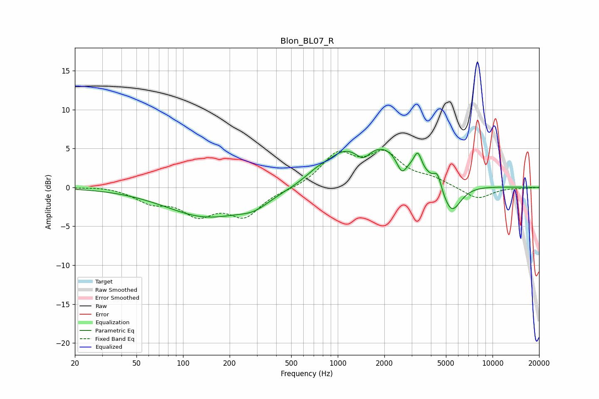

# Blon_BL07_R
See [usage instructions](https://github.com/jaakkopasanen/AutoEq#usage) for more options and info.

### Parametric EQs
Apply preamp of -5.0 dB when using parametric equalizer.

|   # | Type    |   Fc (Hz) |    Q |   Gain (dB) |
|-----|---------|-----------|------|-------------|
|   1 | Peaking |       143 | 0.53 |        -3.7 |
|   2 | Peaking |       288 | 1.44 |        -1.2 |
|   3 | Peaking |       721 | 1.84 |         0.8 |
|   4 | Peaking |      1064 | 1.3  |         2.3 |
|   5 | Peaking |      1460 | 3.16 |        -1.5 |
|   6 | Peaking |      1976 | 0.72 |         5   |
|   7 | Peaking |      2593 | 4.15 |        -2.3 |
|   8 | Peaking |      3288 | 5.88 |         2.1 |
|   9 | Peaking |      4411 | 5.84 |         1.8 |
|  10 | Peaking |      5414 | 2.21 |        -4.2 |

### Fixed Band EQs
When using fixed band (also called graphic) equalizer, apply preamp of **-4.9 dB** (if available) and set gains manually with these parameters.

|   # | Type    |   Fc (Hz) |    Q |   Gain (dB) |
|-----|---------|-----------|------|-------------|
|   1 | Peaking |        31 | 1.41 |         0.2 |
|   2 | Peaking |        62 | 1.41 |        -1.7 |
|   3 | Peaking |       125 | 1.41 |        -3.1 |
|   4 | Peaking |       250 | 1.41 |        -3.4 |
|   5 | Peaking |       500 | 1.41 |        -0.2 |
|   6 | Peaking |      1000 | 1.41 |         4   |
|   7 | Peaking |      2000 | 1.41 |         3.9 |
|   8 | Peaking |      4000 | 1.41 |         0.9 |
|   9 | Peaking |      8000 | 1.41 |        -1.6 |
|  10 | Peaking |     16000 | 1.41 |        -0.1 |

### Graphs

