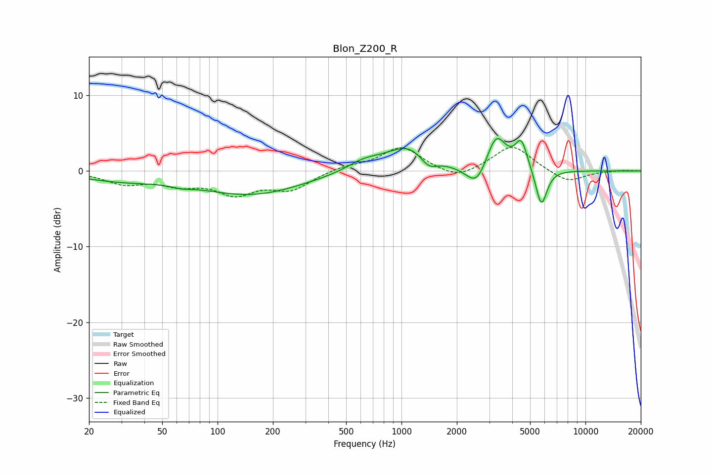

# Blon_Z200_R
See [usage instructions](https://github.com/jaakkopasanen/AutoEq#usage) for more options and info.

### Parametric EQs
Apply preamp of -4.4 dB when using parametric equalizer.

|   # | Type    |   Fc (Hz) |    Q |   Gain (dB) |
|-----|---------|-----------|------|-------------|
|   1 | Peaking |        30 | 0.65 |        -1.1 |
|   2 | Peaking |        64 | 2.67 |        -0.4 |
|   3 | Peaking |       152 | 0.5  |        -3.1 |
|   4 | Peaking |       626 | 1.48 |         1.3 |
|   5 | Peaking |      1091 | 1.19 |         3.3 |
|   6 | Peaking |      1404 | 3.06 |        -1.6 |
|   7 | Peaking |      2564 | 2.48 |        -3   |
|   8 | Peaking |      3269 | 2.63 |         4.9 |
|   9 | Peaking |      4482 | 4.24 |         3.7 |
|  10 | Peaking |      5757 | 4.5  |        -5.1 |

### Fixed Band EQs
When using fixed band (also called graphic) equalizer, apply preamp of **-3.2 dB** (if available) and set gains manually with these parameters.

|   # | Type    |   Fc (Hz) |    Q |   Gain (dB) |
|-----|---------|-----------|------|-------------|
|   1 | Peaking |        31 | 1.41 |        -1.5 |
|   2 | Peaking |        62 | 1.41 |        -1.5 |
|   3 | Peaking |       125 | 1.41 |        -2.7 |
|   4 | Peaking |       250 | 1.41 |        -2.3 |
|   5 | Peaking |       500 | 1.41 |         0.6 |
|   6 | Peaking |      1000 | 1.41 |         3.2 |
|   7 | Peaking |      2000 | 1.41 |        -1.3 |
|   8 | Peaking |      4000 | 1.41 |         3.5 |
|   9 | Peaking |      8000 | 1.41 |        -1.6 |
|  10 | Peaking |     16000 | 1.41 |         0.1 |

### Graphs

