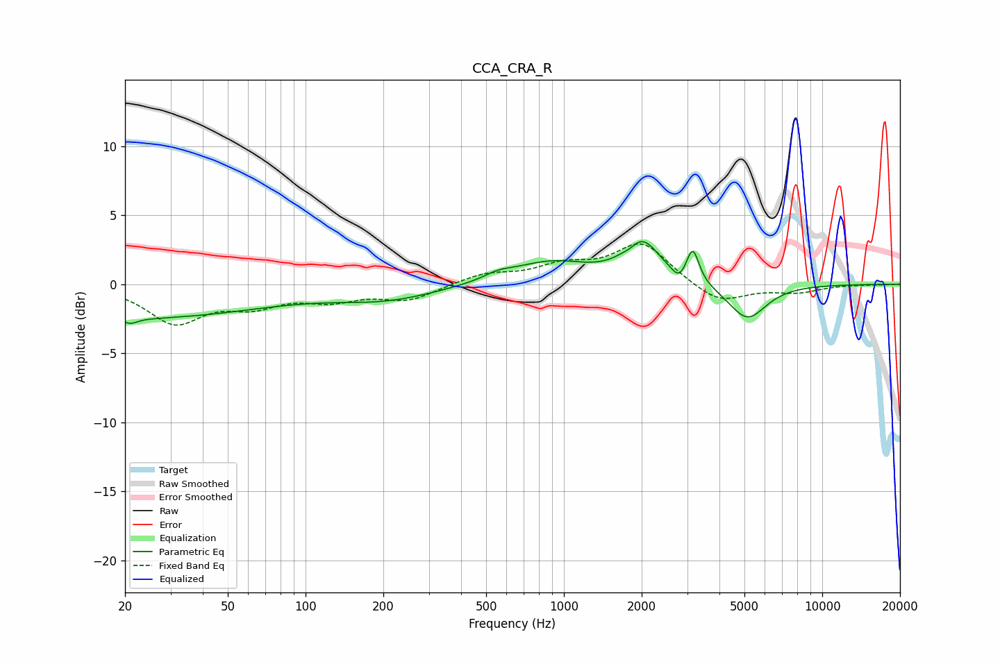

# CCA_CRA_R
See [usage instructions](https://github.com/jaakkopasanen/AutoEq#usage) for more options and info.

### Parametric EQs
Apply preamp of -3.2 dB when using parametric equalizer.

|   # | Type    |   Fc (Hz) |    Q |   Gain (dB) |
|-----|---------|-----------|------|-------------|
|   1 | Peaking |        20 | 0.25 |        -2.5 |
|   2 | Peaking |        21 | 5.54 |        -0.4 |
|   3 | Peaking |       206 | 0.7  |        -1   |
|   4 | Peaking |       557 | 2.64 |         0.4 |
|   5 | Peaking |       884 | 0.91 |         1.6 |
|   6 | Peaking |      1814 | 5.56 |        -0.3 |
|   7 | Peaking |      2001 | 2.06 |         2.9 |
|   8 | Peaking |      2788 | 5.9  |        -0.7 |
|   9 | Peaking |      3155 | 6    |         2.4 |
|  10 | Peaking |      5127 | 1.9  |        -2.6 |

### Fixed Band EQs
When using fixed band (also called graphic) equalizer, apply preamp of **-3.0 dB** (if available) and set gains manually with these parameters.

|   # | Type    |   Fc (Hz) |    Q |   Gain (dB) |
|-----|---------|-----------|------|-------------|
|   1 | Peaking |        31 | 1.41 |        -2.7 |
|   2 | Peaking |        62 | 1.41 |        -1.3 |
|   3 | Peaking |       125 | 1.41 |        -1   |
|   4 | Peaking |       250 | 1.41 |        -1.1 |
|   5 | Peaking |       500 | 1.41 |         0.7 |
|   6 | Peaking |      1000 | 1.41 |         1.2 |
|   7 | Peaking |      2000 | 1.41 |         2.9 |
|   8 | Peaking |      4000 | 1.41 |        -1.5 |
|   9 | Peaking |      8000 | 1.41 |        -0.5 |
|  10 | Peaking |     16000 | 1.41 |        -0   |

### Graphs

