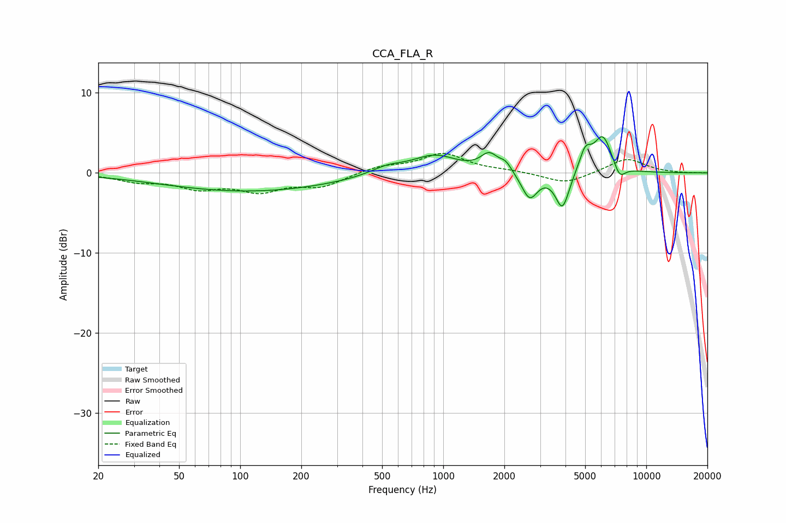

# CCA_FLA_R
See [usage instructions](https://github.com/jaakkopasanen/AutoEq#usage) for more options and info.

### Parametric EQs
Apply preamp of -4.6 dB when using parametric equalizer.

|   # | Type    |   Fc (Hz) |    Q |   Gain (dB) |
|-----|---------|-----------|------|-------------|
|   1 | Peaking |       111 | 0.33 |        -2.3 |
|   2 | Peaking |       528 | 1.67 |         0.9 |
|   3 | Peaking |       906 | 1.27 |         2.2 |
|   4 | Peaking |      1687 | 3.3  |         2.1 |
|   5 | Peaking |      2032 | 4.8  |         1.1 |
|   6 | Peaking |      2664 | 3.59 |        -3.3 |
|   7 | Peaking |      3864 | 4.1  |        -4.6 |
|   8 | Peaking |      5005 | 4.67 |         2.5 |
|   9 | Peaking |      6113 | 3.02 |         4.6 |
|  10 | Peaking |      7379 | 4.72 |        -1.7 |

### Fixed Band EQs
When using fixed band (also called graphic) equalizer, apply preamp of **-2.5 dB** (if available) and set gains manually with these parameters.

|   # | Type    |   Fc (Hz) |    Q |   Gain (dB) |
|-----|---------|-----------|------|-------------|
|   1 | Peaking |        31 | 1.41 |        -0.9 |
|   2 | Peaking |        62 | 1.41 |        -1.7 |
|   3 | Peaking |       125 | 1.41 |        -2   |
|   4 | Peaking |       250 | 1.41 |        -1.6 |
|   5 | Peaking |       500 | 1.41 |         0.8 |
|   6 | Peaking |      1000 | 1.41 |         2.3 |
|   7 | Peaking |      2000 | 1.41 |         0.2 |
|   8 | Peaking |      4000 | 1.41 |        -1.4 |
|   9 | Peaking |      8000 | 1.41 |         1.8 |
|  10 | Peaking |     16000 | 1.41 |        -0   |

### Graphs

