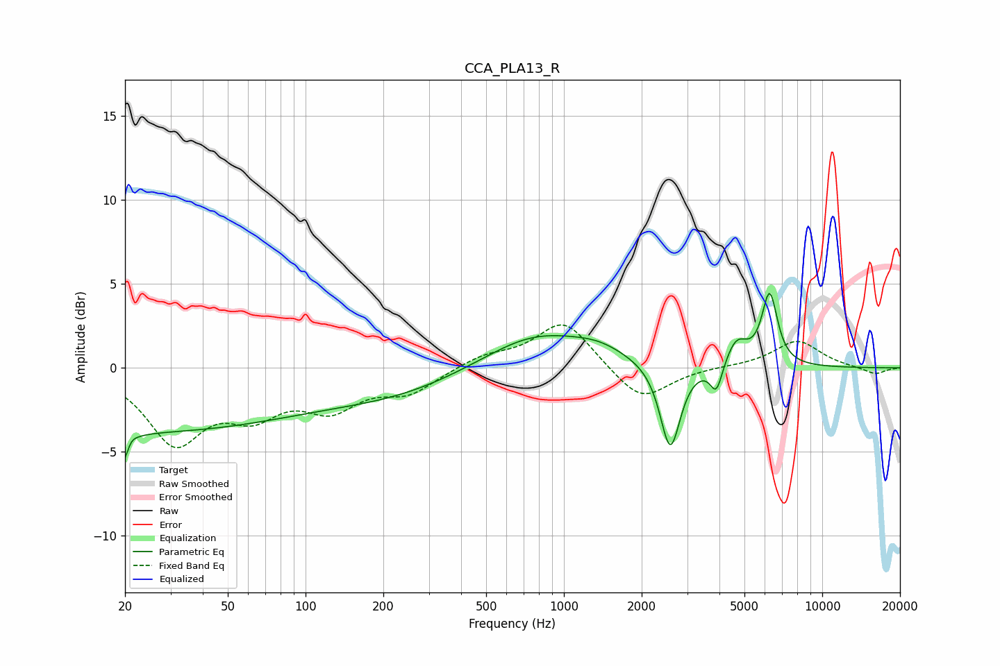

# CCA_PLA13_R
See [usage instructions](https://github.com/jaakkopasanen/AutoEq#usage) for more options and info.

### Parametric EQs
Apply preamp of -4.5 dB when using parametric equalizer.

|   # | Type    |   Fc (Hz) |    Q |   Gain (dB) |
|-----|---------|-----------|------|-------------|
|   1 | Peaking |        20 | 0.18 |        -3.8 |
|   2 | Peaking |        20 | 5.79 |        -3.9 |
|   3 | Peaking |        20 | 6    |         2.6 |
|   4 | Peaking |       226 | 0.51 |        -1.3 |
|   5 | Peaking |       775 | 0.7  |         2.1 |
|   6 | Peaking |      1371 | 1.33 |         0.7 |
|   7 | Peaking |      2581 | 3.66 |        -5.1 |
|   8 | Peaking |      3894 | 5.88 |        -1.7 |
|   9 | Peaking |      4657 | 3.21 |         1.6 |
|  10 | Peaking |      6258 | 4.57 |         4.2 |

### Fixed Band EQs
When using fixed band (also called graphic) equalizer, apply preamp of **-2.7 dB** (if available) and set gains manually with these parameters.

|   # | Type    |   Fc (Hz) |    Q |   Gain (dB) |
|-----|---------|-----------|------|-------------|
|   1 | Peaking |        31 | 1.41 |        -4.2 |
|   2 | Peaking |        62 | 1.41 |        -2.2 |
|   3 | Peaking |       125 | 1.41 |        -2.1 |
|   4 | Peaking |       250 | 1.41 |        -1.3 |
|   5 | Peaking |       500 | 1.41 |         0.7 |
|   6 | Peaking |      1000 | 1.41 |         2.8 |
|   7 | Peaking |      2000 | 1.41 |        -2.1 |
|   8 | Peaking |      4000 | 1.41 |         0   |
|   9 | Peaking |      8000 | 1.41 |         1.6 |
|  10 | Peaking |     16000 | 1.41 |        -0.4 |

### Graphs

