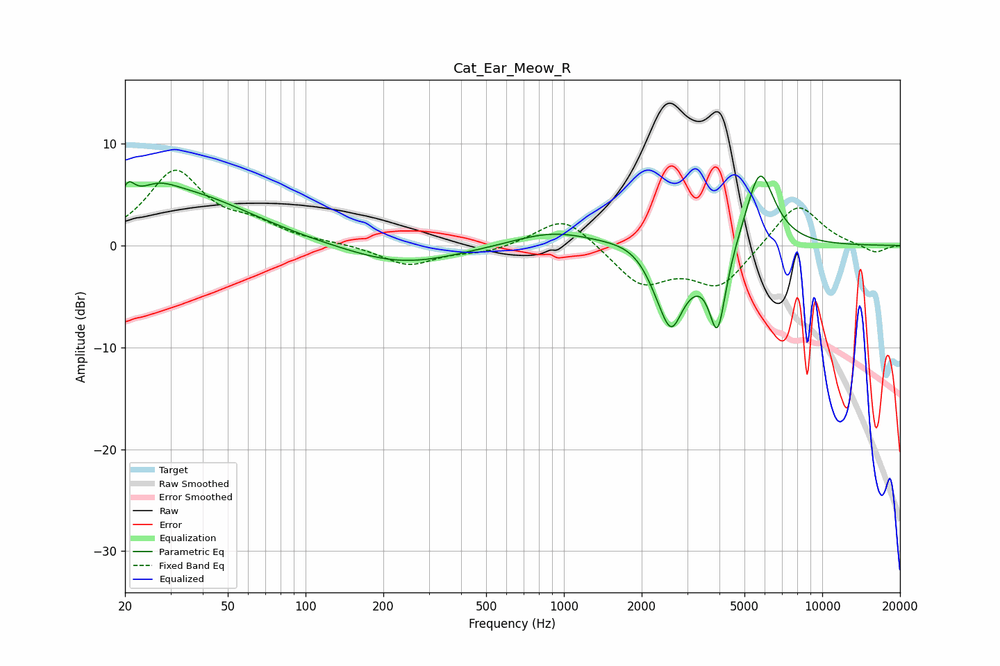

# Cat_Ear_Meow_R
See [usage instructions](https://github.com/jaakkopasanen/AutoEq#usage) for more options and info.

### Parametric EQs
Apply preamp of -6.9 dB when using parametric equalizer.

|   # | Type    |   Fc (Hz) |    Q |   Gain (dB) |
|-----|---------|-----------|------|-------------|
|   1 | Peaking |        21 | 5.76 |         1.9 |
|   2 | Peaking |        27 | 1.88 |         1.5 |
|   3 | Peaking |        34 | 0.54 |         4.8 |
|   4 | Peaking |       236 | 0.66 |        -1.9 |
|   5 | Peaking |       908 | 0.91 |         1.5 |
|   6 | Peaking |      2062 | 1.29 |         2.6 |
|   7 | Peaking |      2511 | 1.67 |        -7.8 |
|   8 | Peaking |      2615 | 4.21 |        -2.2 |
|   9 | Peaking |      3934 | 4.2  |        -8   |
|  10 | Peaking |      5734 | 2.41 |         8   |

### Fixed Band EQs
When using fixed band (also called graphic) equalizer, apply preamp of **-7.5 dB** (if available) and set gains manually with these parameters.

|   # | Type    |   Fc (Hz) |    Q |   Gain (dB) |
|-----|---------|-----------|------|-------------|
|   1 | Peaking |        31 | 1.41 |         7.1 |
|   2 | Peaking |        62 | 1.41 |         1.6 |
|   3 | Peaking |       125 | 1.41 |         0.2 |
|   4 | Peaking |       250 | 1.41 |        -2   |
|   5 | Peaking |       500 | 1.41 |        -0.6 |
|   6 | Peaking |      1000 | 1.41 |         3.1 |
|   7 | Peaking |      2000 | 1.41 |        -3.7 |
|   8 | Peaking |      4000 | 1.41 |        -4   |
|   9 | Peaking |      8000 | 1.41 |         4.4 |
|  10 | Peaking |     16000 | 1.41 |        -0.8 |

### Graphs

