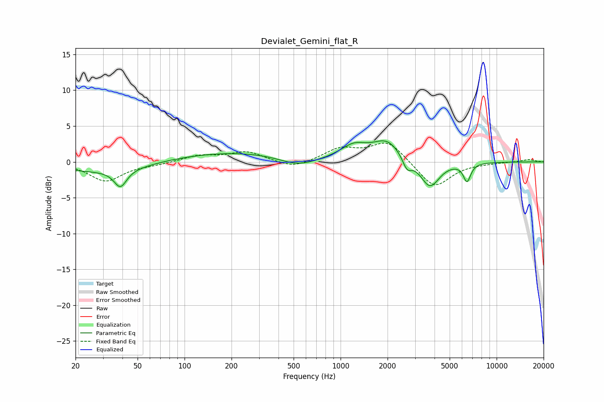

# Devialet_Gemini_flat_R
See [usage instructions](https://github.com/jaakkopasanen/AutoEq#usage) for more options and info.

### Parametric EQs
Apply preamp of -3.0 dB when using parametric equalizer.

|   # | Type    |   Fc (Hz) |    Q |   Gain (dB) |
|-----|---------|-----------|------|-------------|
|   1 | Peaking |        33 | 0.44 |        -1.6 |
|   2 | Peaking |        39 | 3.58 |        -2.5 |
|   3 | Peaking |       212 | 0.26 |         1.5 |
|   4 | Peaking |       535 | 1.08 |        -1.6 |
|   5 | Peaking |      1217 | 1.7  |         1.8 |
|   6 | Peaking |      1988 | 1.55 |         2.8 |
|   7 | Peaking |      2666 | 4.84 |        -1.7 |
|   8 | Peaking |      3735 | 2.33 |        -4.1 |
|   9 | Peaking |      3741 | 2.8  |         0.3 |
|  10 | Peaking |      6461 | 5.88 |        -2.5 |

### Fixed Band EQs
When using fixed band (also called graphic) equalizer, apply preamp of **-2.7 dB** (if available) and set gains manually with these parameters.

|   # | Type    |   Fc (Hz) |    Q |   Gain (dB) |
|-----|---------|-----------|------|-------------|
|   1 | Peaking |        31 | 1.41 |        -2.7 |
|   2 | Peaking |        62 | 1.41 |        -0.3 |
|   3 | Peaking |       125 | 1.41 |         0.9 |
|   4 | Peaking |       250 | 1.41 |         1.4 |
|   5 | Peaking |       500 | 1.41 |        -1   |
|   6 | Peaking |      1000 | 1.41 |         1.8 |
|   7 | Peaking |      2000 | 1.41 |         2.9 |
|   8 | Peaking |      4000 | 1.41 |        -3.7 |
|   9 | Peaking |      8000 | 1.41 |        -0.1 |
|  10 | Peaking |     16000 | 1.41 |         0.3 |

### Graphs

