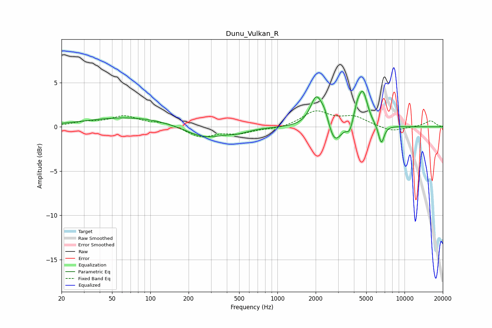

# Dunu_Vulkan_R
See [usage instructions](https://github.com/jaakkopasanen/AutoEq#usage) for more options and info.

### Parametric EQs
Apply preamp of -4.1 dB when using parametric equalizer.

|   # | Type    |   Fc (Hz) |    Q |   Gain (dB) |
|-----|---------|-----------|------|-------------|
|   1 | Peaking |        72 | 0.4  |         1.1 |
|   2 | Peaking |       268 | 0.88 |        -1.4 |
|   3 | Peaking |       494 | 1.78 |        -0.3 |
|   4 | Peaking |      2026 | 2.98 |         3.5 |
|   5 | Peaking |      2363 | 4.37 |         1.2 |
|   6 | Peaking |      2813 | 2.74 |        -2.4 |
|   7 | Peaking |      3700 | 6    |        -1.1 |
|   8 | Peaking |      4226 | 6    |         1.1 |
|   9 | Peaking |      4692 | 3.63 |         3.9 |
|  10 | Peaking |      6565 | 6    |        -2.2 |

### Fixed Band EQs
When using fixed band (also called graphic) equalizer, apply preamp of **-1.9 dB** (if available) and set gains manually with these parameters.

|   # | Type    |   Fc (Hz) |    Q |   Gain (dB) |
|-----|---------|-----------|------|-------------|
|   1 | Peaking |        31 | 1.41 |         0.5 |
|   2 | Peaking |        62 | 1.41 |         1.1 |
|   3 | Peaking |       125 | 1.41 |         0.5 |
|   4 | Peaking |       250 | 1.41 |        -1.1 |
|   5 | Peaking |       500 | 1.41 |        -0.7 |
|   6 | Peaking |      1000 | 1.41 |        -0.2 |
|   7 | Peaking |      2000 | 1.41 |         1.7 |
|   8 | Peaking |      4000 | 1.41 |         1   |
|   9 | Peaking |      8000 | 1.41 |        -0.6 |
|  10 | Peaking |     16000 | 1.41 |         0.7 |

### Graphs

