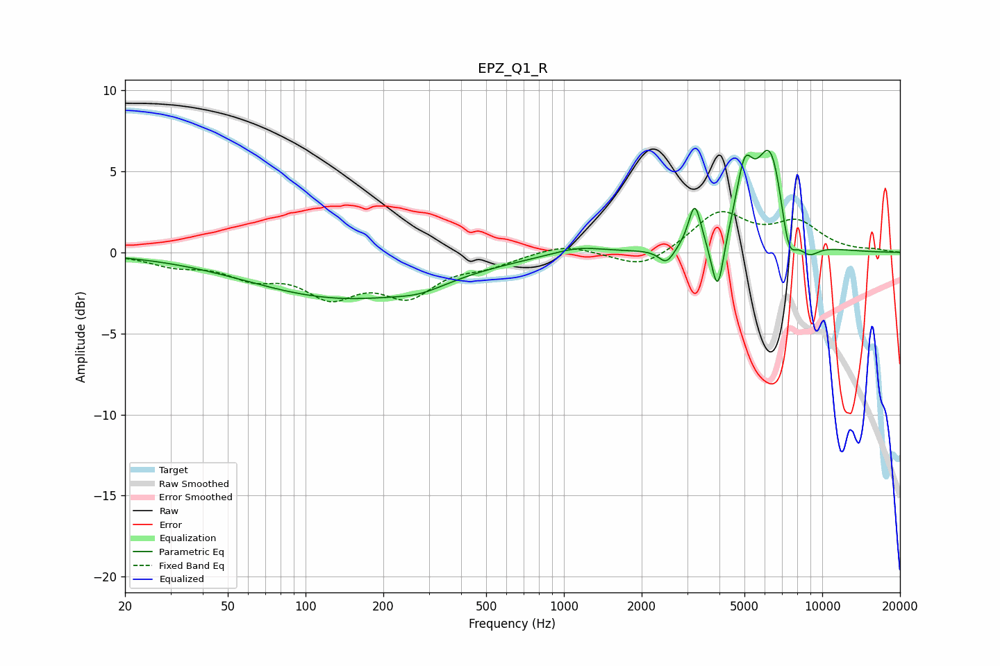

# EPZ_Q1_R
See [usage instructions](https://github.com/jaakkopasanen/AutoEq#usage) for more options and info.

### Parametric EQs
Apply preamp of -6.4 dB when using parametric equalizer.

|   # | Type    |   Fc (Hz) |    Q |   Gain (dB) |
|-----|---------|-----------|------|-------------|
|   1 | Peaking |       141 | 0.38 |        -2.8 |
|   2 | Peaking |       278 | 1.48 |        -0.5 |
|   3 | Peaking |      1134 | 1.43 |         0.5 |
|   4 | Peaking |      2495 | 4.72 |        -1   |
|   5 | Peaking |      3212 | 5.85 |         2.7 |
|   6 | Peaking |      3938 | 5.9  |        -3.7 |
|   7 | Peaking |      5001 | 4.23 |         3.7 |
|   8 | Peaking |      6323 | 2.33 |         6.6 |
|   9 | Peaking |      7391 | 4.17 |        -3   |
|  10 | Peaking |      8849 | 3.05 |        -1   |

### Fixed Band EQs
When using fixed band (also called graphic) equalizer, apply preamp of **-2.6 dB** (if available) and set gains manually with these parameters.

|   # | Type    |   Fc (Hz) |    Q |   Gain (dB) |
|-----|---------|-----------|------|-------------|
|   1 | Peaking |        31 | 1.41 |        -0.7 |
|   2 | Peaking |        62 | 1.41 |        -1.3 |
|   3 | Peaking |       125 | 1.41 |        -2.3 |
|   4 | Peaking |       250 | 1.41 |        -2.4 |
|   5 | Peaking |       500 | 1.41 |        -0.7 |
|   6 | Peaking |      1000 | 1.41 |         0.6 |
|   7 | Peaking |      2000 | 1.41 |        -1.1 |
|   8 | Peaking |      4000 | 1.41 |         2.4 |
|   9 | Peaking |      8000 | 1.41 |         1.7 |
|  10 | Peaking |     16000 | 1.41 |         0.1 |

### Graphs

