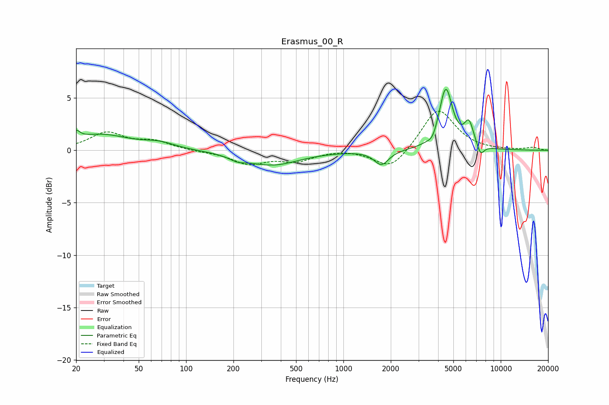

# Erasmus_00_R
See [usage instructions](https://github.com/jaakkopasanen/AutoEq#usage) for more options and info.

### Parametric EQs
Apply preamp of -5.9 dB when using parametric equalizer.

|   # | Type    |   Fc (Hz) |    Q |   Gain (dB) |
|-----|---------|-----------|------|-------------|
|   1 | Peaking |        20 | 5.97 |         0.8 |
|   2 | Peaking |        28 | 0.77 |         1.5 |
|   3 | Peaking |        68 | 1.45 |         0.5 |
|   4 | Peaking |       212 | 2.74 |        -0.4 |
|   5 | Peaking |       351 | 0.82 |        -1.4 |
|   6 | Peaking |      1745 | 3.1  |        -1.4 |
|   7 | Peaking |      3691 | 5.14 |        -0.6 |
|   8 | Peaking |      4475 | 3.3  |         5.8 |
|   9 | Peaking |      6282 | 4.45 |         2.3 |
|  10 | Peaking |      7435 | 5.76 |        -1.1 |

### Fixed Band EQs
When using fixed band (also called graphic) equalizer, apply preamp of **-3.8 dB** (if available) and set gains manually with these parameters.

|   # | Type    |   Fc (Hz) |    Q |   Gain (dB) |
|-----|---------|-----------|------|-------------|
|   1 | Peaking |        31 | 1.41 |         1.6 |
|   2 | Peaking |        62 | 1.41 |         0.8 |
|   3 | Peaking |       125 | 1.41 |        -0.1 |
|   4 | Peaking |       250 | 1.41 |        -1.2 |
|   5 | Peaking |       500 | 1.41 |        -0.9 |
|   6 | Peaking |      1000 | 1.41 |         0.2 |
|   7 | Peaking |      2000 | 1.41 |        -1.9 |
|   8 | Peaking |      4000 | 1.41 |         4.1 |
|   9 | Peaking |      8000 | 1.41 |        -0   |
|  10 | Peaking |     16000 | 1.41 |         0.3 |

### Graphs

