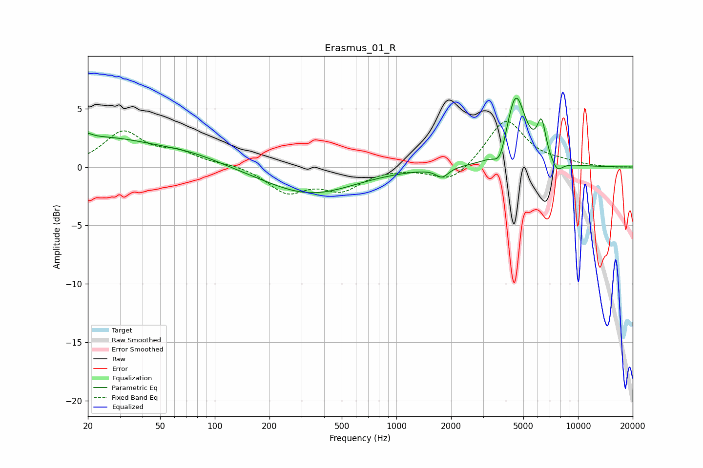

# Erasmus_01_R
See [usage instructions](https://github.com/jaakkopasanen/AutoEq#usage) for more options and info.

### Parametric EQs
Apply preamp of -6.0 dB when using parametric equalizer.

|   # | Type    |   Fc (Hz) |    Q |   Gain (dB) |
|-----|---------|-----------|------|-------------|
|   1 | Peaking |        20 | 5.87 |         2.5 |
|   2 | Peaking |        20 | 5.97 |        -2.1 |
|   3 | Peaking |        22 | 0.43 |         2.5 |
|   4 | Peaking |        75 | 0.79 |         0.7 |
|   5 | Peaking |       334 | 0.58 |        -2.3 |
|   6 | Peaking |      1784 | 4.24 |        -0.8 |
|   7 | Peaking |      3727 | 4.02 |        -1.8 |
|   8 | Peaking |      4532 | 2.58 |         6.3 |
|   9 | Peaking |      6298 | 5.7  |         3   |
|  10 | Peaking |      7659 | 4.2  |        -1   |

### Fixed Band EQs
When using fixed band (also called graphic) equalizer, apply preamp of **-4.0 dB** (if available) and set gains manually with these parameters.

|   # | Type    |   Fc (Hz) |    Q |   Gain (dB) |
|-----|---------|-----------|------|-------------|
|   1 | Peaking |        31 | 1.41 |         2.9 |
|   2 | Peaking |        62 | 1.41 |         1.1 |
|   3 | Peaking |       125 | 1.41 |         0.2 |
|   4 | Peaking |       250 | 1.41 |        -2.1 |
|   5 | Peaking |       500 | 1.41 |        -1.8 |
|   6 | Peaking |      1000 | 1.41 |        -0   |
|   7 | Peaking |      2000 | 1.41 |        -1.4 |
|   8 | Peaking |      4000 | 1.41 |         4.1 |
|   9 | Peaking |      8000 | 1.41 |         0.3 |
|  10 | Peaking |     16000 | 1.41 |        -0   |

### Graphs

