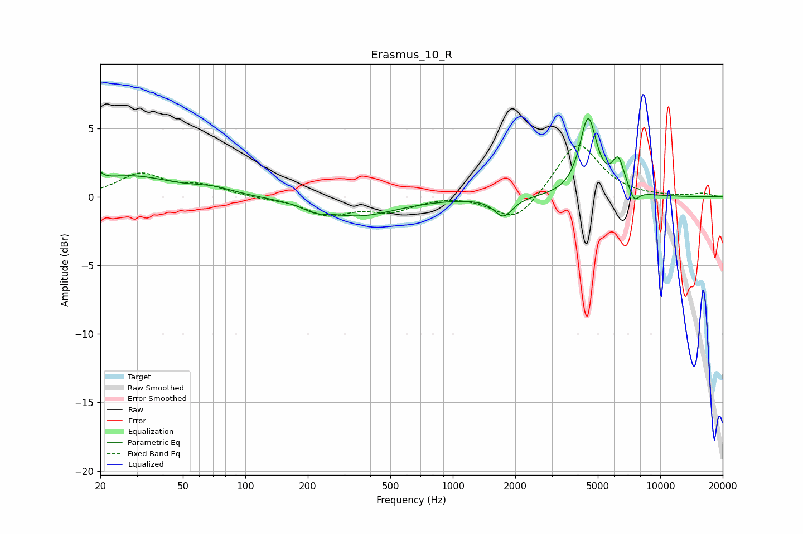

# Erasmus_10_R
See [usage instructions](https://github.com/jaakkopasanen/AutoEq#usage) for more options and info.

### Parametric EQs
Apply preamp of -5.8 dB when using parametric equalizer.

|   # | Type    |   Fc (Hz) |    Q |   Gain (dB) |
|-----|---------|-----------|------|-------------|
|   1 | Peaking |        20 | 5.99 |         1.6 |
|   2 | Peaking |        20 | 6    |        -1.1 |
|   3 | Peaking |        28 | 0.68 |         1.5 |
|   4 | Peaking |        70 | 1.49 |         0.4 |
|   5 | Peaking |       216 | 2.56 |        -0.4 |
|   6 | Peaking |       351 | 0.77 |        -1.4 |
|   7 | Peaking |      1752 | 3.22 |        -1.4 |
|   8 | Peaking |      4491 | 3.44 |         5.6 |
|   9 | Peaking |      6271 | 4.56 |         2.3 |
|  10 | Peaking |      7498 | 5.9  |        -0.9 |

### Fixed Band EQs
When using fixed band (also called graphic) equalizer, apply preamp of **-3.8 dB** (if available) and set gains manually with these parameters.

|   # | Type    |   Fc (Hz) |    Q |   Gain (dB) |
|-----|---------|-----------|------|-------------|
|   1 | Peaking |        31 | 1.41 |         1.6 |
|   2 | Peaking |        62 | 1.41 |         0.7 |
|   3 | Peaking |       125 | 1.41 |        -0.1 |
|   4 | Peaking |       250 | 1.41 |        -1.2 |
|   5 | Peaking |       500 | 1.41 |        -0.9 |
|   6 | Peaking |      1000 | 1.41 |         0.2 |
|   7 | Peaking |      2000 | 1.41 |        -2   |
|   8 | Peaking |      4000 | 1.41 |         4.1 |
|   9 | Peaking |      8000 | 1.41 |        -0   |
|  10 | Peaking |     16000 | 1.41 |         0.2 |

### Graphs

