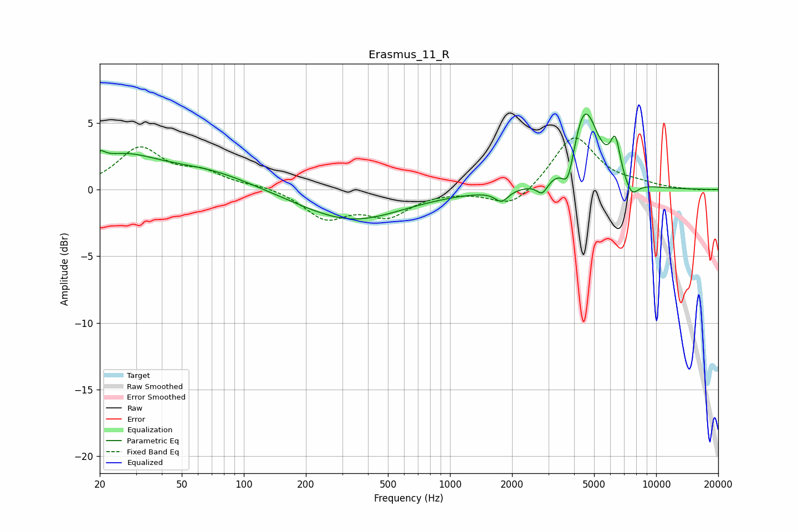

# Erasmus_11_R
See [usage instructions](https://github.com/jaakkopasanen/AutoEq#usage) for more options and info.

### Parametric EQs
Apply preamp of -5.8 dB when using parametric equalizer.

|   # | Type    |   Fc (Hz) |    Q |   Gain (dB) |
|-----|---------|-----------|------|-------------|
|   1 | Peaking |        20 | 5.73 |         0.7 |
|   2 | Peaking |        25 | 0.79 |         2.3 |
|   3 | Peaking |        66 | 0.64 |         1.2 |
|   4 | Peaking |       332 | 0.57 |        -2.3 |
|   5 | Peaking |      1780 | 4.33 |        -0.9 |
|   6 | Peaking |      2802 | 5.28 |        -1   |
|   7 | Peaking |      3744 | 4.71 |        -2.4 |
|   8 | Peaking |      4496 | 2.13 |         6.2 |
|   9 | Peaking |      6339 | 5.8  |         2.7 |
|  10 | Peaking |      7601 | 4.04 |        -1.2 |

### Fixed Band EQs
When using fixed band (also called graphic) equalizer, apply preamp of **-4.0 dB** (if available) and set gains manually with these parameters.

|   # | Type    |   Fc (Hz) |    Q |   Gain (dB) |
|-----|---------|-----------|------|-------------|
|   1 | Peaking |        31 | 1.41 |         3   |
|   2 | Peaking |        62 | 1.41 |         1.1 |
|   3 | Peaking |       125 | 1.41 |         0.3 |
|   4 | Peaking |       250 | 1.41 |        -2.1 |
|   5 | Peaking |       500 | 1.41 |        -1.8 |
|   6 | Peaking |      1000 | 1.41 |        -0   |
|   7 | Peaking |      2000 | 1.41 |        -1.4 |
|   8 | Peaking |      4000 | 1.41 |         4.1 |
|   9 | Peaking |      8000 | 1.41 |         0.3 |
|  10 | Peaking |     16000 | 1.41 |        -0.1 |

### Graphs

