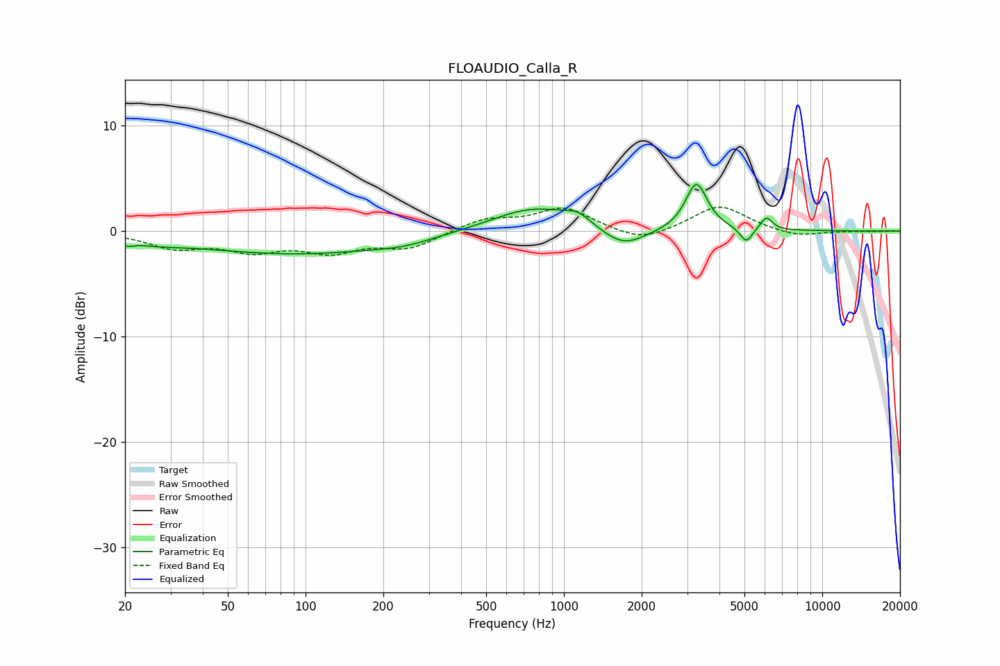

# FLOAUDIO_Calla_R
See [usage instructions](https://github.com/jaakkopasanen/AutoEq#usage) for more options and info.

### Parametric EQs
Apply preamp of -4.5 dB when using parametric equalizer.

|   # | Type    |   Fc (Hz) |    Q |   Gain (dB) |
|-----|---------|-----------|------|-------------|
|   1 | Peaking |        20 | 5.87 |        -0.4 |
|   2 | Peaking |        26 | 1.28 |        -0.5 |
|   3 | Peaking |        92 | 0.35 |        -2.1 |
|   4 | Peaking |       240 | 1.28 |        -0.4 |
|   5 | Peaking |       775 | 0.84 |         2.4 |
|   6 | Peaking |      1136 | 3    |         0.8 |
|   7 | Peaking |      1695 | 1.63 |        -1.9 |
|   8 | Peaking |      3260 | 3.37 |         4.5 |
|   9 | Peaking |      5079 | 6    |        -1.4 |
|  10 | Peaking |      6083 | 6    |         1.2 |

### Fixed Band EQs
When using fixed band (also called graphic) equalizer, apply preamp of **-2.4 dB** (if available) and set gains manually with these parameters.

|   # | Type    |   Fc (Hz) |    Q |   Gain (dB) |
|-----|---------|-----------|------|-------------|
|   1 | Peaking |        31 | 1.41 |        -1.5 |
|   2 | Peaking |        62 | 1.41 |        -1.6 |
|   3 | Peaking |       125 | 1.41 |        -1.7 |
|   4 | Peaking |       250 | 1.41 |        -1.5 |
|   5 | Peaking |       500 | 1.41 |         1.1 |
|   6 | Peaking |      1000 | 1.41 |         2.2 |
|   7 | Peaking |      2000 | 1.41 |        -1.2 |
|   8 | Peaking |      4000 | 1.41 |         2.5 |
|   9 | Peaking |      8000 | 1.41 |        -0.6 |
|  10 | Peaking |     16000 | 1.41 |        -0   |

### Graphs

