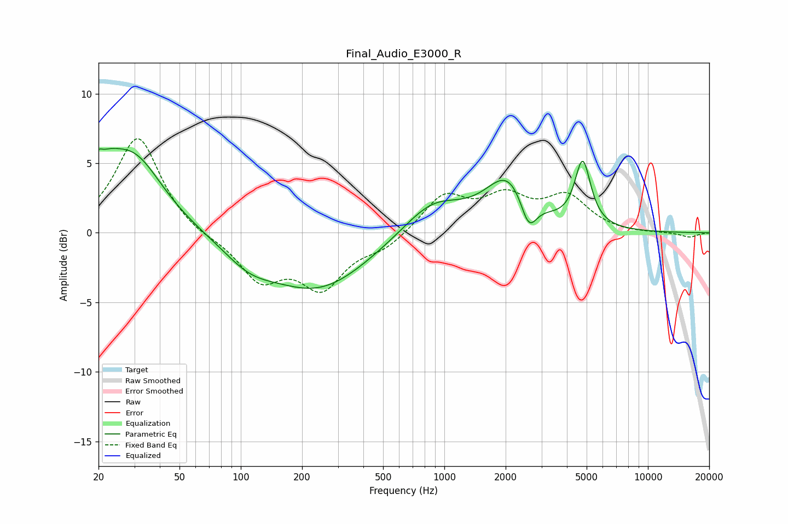

# Final_Audio_E3000_R
See [usage instructions](https://github.com/jaakkopasanen/AutoEq#usage) for more options and info.

### Parametric EQs
Apply preamp of -6.2 dB when using parametric equalizer.

|   # | Type    |   Fc (Hz) |    Q |   Gain (dB) |
|-----|---------|-----------|------|-------------|
|   1 | Peaking |        20 | 5.86 |         3.3 |
|   2 | Peaking |        20 | 5.87 |        -2.4 |
|   3 | Peaking |        21 | 1.93 |         2   |
|   4 | Peaking |        30 | 0.97 |         5.3 |
|   5 | Peaking |       110 | 1.12 |        -1.4 |
|   6 | Peaking |       240 | 0.57 |        -4   |
|   7 | Peaking |       876 | 0.96 |         2.4 |
|   8 | Peaking |      2071 | 1.26 |         3.8 |
|   9 | Peaking |      2594 | 3.48 |        -2.4 |
|  10 | Peaking |      4784 | 3.63 |         4.7 |

### Fixed Band EQs
When using fixed band (also called graphic) equalizer, apply preamp of **-6.9 dB** (if available) and set gains manually with these parameters.

|   # | Type    |   Fc (Hz) |    Q |   Gain (dB) |
|-----|---------|-----------|------|-------------|
|   1 | Peaking |        31 | 1.41 |         7   |
|   2 | Peaking |        62 | 1.41 |        -0.4 |
|   3 | Peaking |       125 | 1.41 |        -3.2 |
|   4 | Peaking |       250 | 1.41 |        -3.7 |
|   5 | Peaking |       500 | 1.41 |        -1   |
|   6 | Peaking |      1000 | 1.41 |         2.6 |
|   7 | Peaking |      2000 | 1.41 |         2.3 |
|   8 | Peaking |      4000 | 1.41 |         2.4 |
|   9 | Peaking |      8000 | 1.41 |        -0.1 |
|  10 | Peaking |     16000 | 1.41 |        -0.3 |

### Graphs

