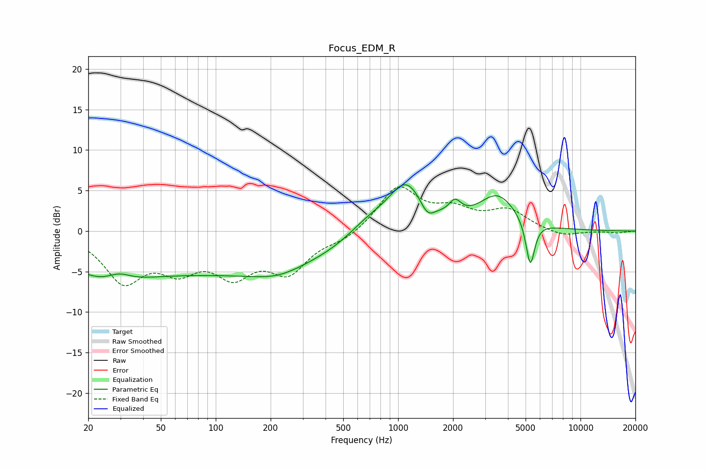

# Focus_EDM_R
See [usage instructions](https://github.com/jaakkopasanen/AutoEq#usage) for more options and info.

### Parametric EQs
Apply preamp of -5.8 dB when using parametric equalizer.

|   # | Type    |   Fc (Hz) |    Q |   Gain (dB) |
|-----|---------|-----------|------|-------------|
|   1 | Peaking |        24 | 0.62 |        -4.6 |
|   2 | Peaking |        29 | 2.23 |         1.1 |
|   3 | Peaking |       139 | 0.25 |        -4.8 |
|   4 | Peaking |       217 | 1.04 |        -1   |
|   5 | Peaking |       676 | 1.24 |         1.8 |
|   6 | Peaking |      1104 | 1.39 |         6.1 |
|   7 | Peaking |      1445 | 3.65 |        -1.8 |
|   8 | Peaking |      2051 | 4.3  |         1.7 |
|   9 | Peaking |      3514 | 1.35 |         4.2 |
|  10 | Peaking |      5305 | 5.78 |        -5.7 |

### Fixed Band EQs
When using fixed band (also called graphic) equalizer, apply preamp of **-5.6 dB** (if available) and set gains manually with these parameters.

|   # | Type    |   Fc (Hz) |    Q |   Gain (dB) |
|-----|---------|-----------|------|-------------|
|   1 | Peaking |        31 | 1.41 |        -5.8 |
|   2 | Peaking |        62 | 1.41 |        -3.8 |
|   3 | Peaking |       125 | 1.41 |        -4.6 |
|   4 | Peaking |       250 | 1.41 |        -4.6 |
|   5 | Peaking |       500 | 1.41 |        -1   |
|   6 | Peaking |      1000 | 1.41 |         5.4 |
|   7 | Peaking |      2000 | 1.41 |         2.2 |
|   8 | Peaking |      4000 | 1.41 |         2.4 |
|   9 | Peaking |      8000 | 1.41 |        -0.8 |
|  10 | Peaking |     16000 | 1.41 |        -0.2 |

### Graphs

