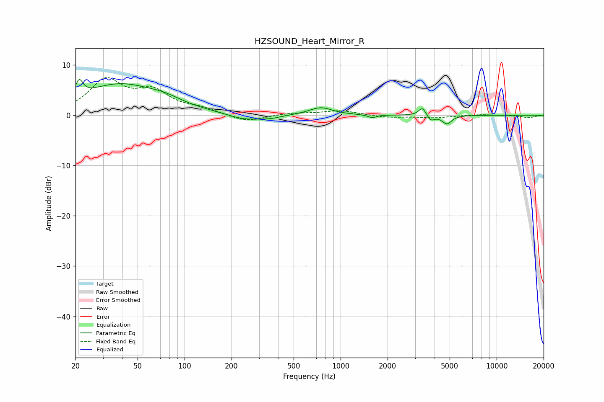

# HZSOUND_Heart_Mirror_R
See [usage instructions](https://github.com/jaakkopasanen/AutoEq#usage) for more options and info.

### Parametric EQs
Apply preamp of -7.2 dB when using parametric equalizer.

|   # | Type    |   Fc (Hz) |    Q |   Gain (dB) |
|-----|---------|-----------|------|-------------|
|   1 | Peaking |        21 | 5.98 |         3.1 |
|   2 | Peaking |        38 | 0.56 |         6   |
|   3 | Peaking |        75 | 1.38 |         1   |
|   4 | Peaking |       242 | 1.36 |        -1.1 |
|   5 | Peaking |       352 | 2.1  |        -0.5 |
|   6 | Peaking |       745 | 1.93 |         1.5 |
|   7 | Peaking |      1593 | 5.54 |        -0.6 |
|   8 | Peaking |      3350 | 6    |         1.8 |
|   9 | Peaking |      3772 | 5.92 |        -1.2 |
|  10 | Peaking |      4804 | 4.76 |        -1.7 |

### Fixed Band EQs
When using fixed band (also called graphic) equalizer, apply preamp of **-7.6 dB** (if available) and set gains manually with these parameters.

|   # | Type    |   Fc (Hz) |    Q |   Gain (dB) |
|-----|---------|-----------|------|-------------|
|   1 | Peaking |        31 | 1.41 |         6.7 |
|   2 | Peaking |        62 | 1.41 |         4.2 |
|   3 | Peaking |       125 | 1.41 |         1.1 |
|   4 | Peaking |       250 | 1.41 |        -1.4 |
|   5 | Peaking |       500 | 1.41 |         0.4 |
|   6 | Peaking |      1000 | 1.41 |         0.9 |
|   7 | Peaking |      2000 | 1.41 |        -0.5 |
|   8 | Peaking |      4000 | 1.41 |        -0.5 |
|   9 | Peaking |      8000 | 1.41 |         0.2 |
|  10 | Peaking |     16000 | 1.41 |        -0.5 |

### Graphs

