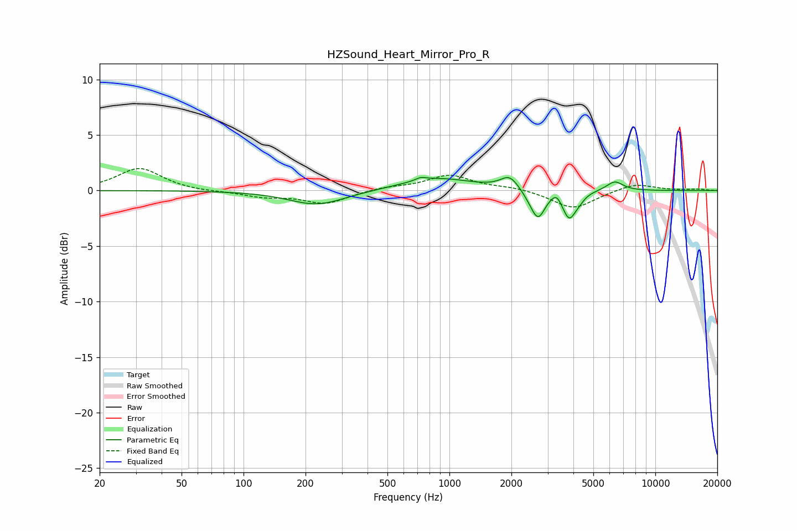

# HZSound_Heart_Mirror_Pro_R
See [usage instructions](https://github.com/jaakkopasanen/AutoEq#usage) for more options and info.

### Parametric EQs
Apply preamp of -1.3 dB when using parametric equalizer.

|   # | Type    |   Fc (Hz) |    Q |   Gain (dB) |
|-----|---------|-----------|------|-------------|
|   1 | Peaking |       228 | 1.04 |        -1.3 |
|   2 | Peaking |       725 | 5.84 |         0.3 |
|   3 | Peaking |       873 | 0.81 |         1.1 |
|   4 | Peaking |      1960 | 3.27 |         1.2 |
|   5 | Peaking |      2493 | 3.7  |        -0.5 |
|   6 | Peaking |      2702 | 4.35 |        -2.2 |
|   7 | Peaking |      3309 | 6    |         0.7 |
|   8 | Peaking |      3816 | 4.33 |        -2.4 |
|   9 | Peaking |      4286 | 5.69 |        -0.4 |
|  10 | Peaking |      6354 | 3.4  |         0.9 |

### Fixed Band EQs
When using fixed band (also called graphic) equalizer, apply preamp of **-2.1 dB** (if available) and set gains manually with these parameters.

|   # | Type    |   Fc (Hz) |    Q |   Gain (dB) |
|-----|---------|-----------|------|-------------|
|   1 | Peaking |        31 | 1.41 |         2   |
|   2 | Peaking |        62 | 1.41 |        -0.1 |
|   3 | Peaking |       125 | 1.41 |        -0.5 |
|   4 | Peaking |       250 | 1.41 |        -1.2 |
|   5 | Peaking |       500 | 1.41 |         0.3 |
|   6 | Peaking |      1000 | 1.41 |         1.4 |
|   7 | Peaking |      2000 | 1.41 |         0.3 |
|   8 | Peaking |      4000 | 1.41 |        -1.7 |
|   9 | Peaking |      8000 | 1.41 |         0.7 |
|  10 | Peaking |     16000 | 1.41 |         0.1 |

### Graphs

