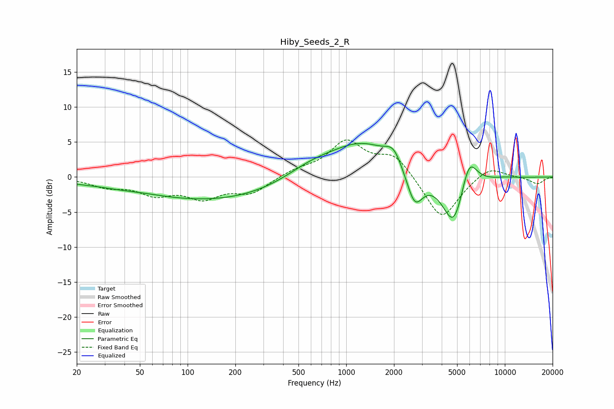

# Hiby_Seeds_2_R
See [usage instructions](https://github.com/jaakkopasanen/AutoEq#usage) for more options and info.

### Parametric EQs
Apply preamp of -4.9 dB when using parametric equalizer.

|   # | Type    |   Fc (Hz) |    Q |   Gain (dB) |
|-----|---------|-----------|------|-------------|
|   1 | Peaking |        21 | 0.93 |        -0.4 |
|   2 | Peaking |        36 | 1.55 |        -0.2 |
|   3 | Peaking |       145 | 0.3  |        -3.3 |
|   4 | Peaking |       598 | 0.84 |         1.7 |
|   5 | Peaking |      1276 | 0.68 |         4.7 |
|   6 | Peaking |      1990 | 2.8  |         2.2 |
|   7 | Peaking |      2701 | 2.66 |        -5   |
|   8 | Peaking |      4775 | 1.91 |        -7.9 |
|   9 | Peaking |      5924 | 2.67 |         5   |
|  10 | Peaking |     10000 | 2.26 |         0.1 |

### Fixed Band EQs
When using fixed band (also called graphic) equalizer, apply preamp of **-5.4 dB** (if available) and set gains manually with these parameters.

|   # | Type    |   Fc (Hz) |    Q |   Gain (dB) |
|-----|---------|-----------|------|-------------|
|   1 | Peaking |        31 | 1.41 |        -1.2 |
|   2 | Peaking |        62 | 1.41 |        -2.2 |
|   3 | Peaking |       125 | 1.41 |        -2.7 |
|   4 | Peaking |       250 | 1.41 |        -2.2 |
|   5 | Peaking |       500 | 1.41 |         0.9 |
|   6 | Peaking |      1000 | 1.41 |         4.9 |
|   7 | Peaking |      2000 | 1.41 |         3.1 |
|   8 | Peaking |      4000 | 1.41 |        -6.3 |
|   9 | Peaking |      8000 | 1.41 |         1.7 |
|  10 | Peaking |     16000 | 1.41 |        -1   |

### Graphs

