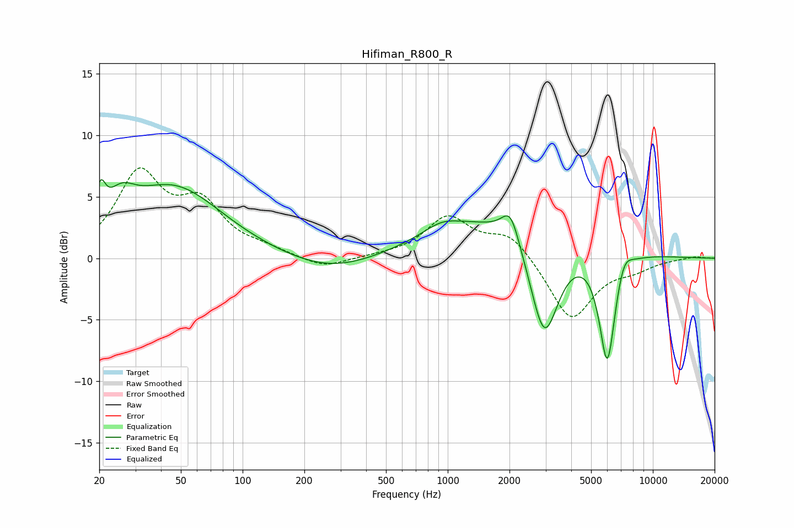

# Hifiman_R800_R
See [usage instructions](https://github.com/jaakkopasanen/AutoEq#usage) for more options and info.

### Parametric EQs
Apply preamp of -6.5 dB when using parametric equalizer.

|   # | Type    |   Fc (Hz) |    Q |   Gain (dB) |
|-----|---------|-----------|------|-------------|
|   1 | Peaking |        20 | 5.98 |         2.6 |
|   2 | Peaking |        25 | 2.12 |         2.1 |
|   3 | Peaking |        46 | 0.59 |         5.7 |
|   4 | Peaking |       270 | 0.65 |        -1.3 |
|   5 | Peaking |       935 | 1.61 |         0.9 |
|   6 | Peaking |      2024 | 3.33 |         2.5 |
|   7 | Peaking |      2046 | 0.39 |         3.7 |
|   8 | Peaking |      2957 | 1.89 |        -9   |
|   9 | Peaking |      5997 | 3.42 |        -9.4 |
|  10 | Peaking |      7211 | 3.57 |         1.5 |

### Fixed Band EQs
When using fixed band (also called graphic) equalizer, apply preamp of **-7.4 dB** (if available) and set gains manually with these parameters.

|   # | Type    |   Fc (Hz) |    Q |   Gain (dB) |
|-----|---------|-----------|------|-------------|
|   1 | Peaking |        31 | 1.41 |         6.6 |
|   2 | Peaking |        62 | 1.41 |         3.9 |
|   3 | Peaking |       125 | 1.41 |         0.6 |
|   4 | Peaking |       250 | 1.41 |        -0.9 |
|   5 | Peaking |       500 | 1.41 |         0.1 |
|   6 | Peaking |      1000 | 1.41 |         3.3 |
|   7 | Peaking |      2000 | 1.41 |         2   |
|   8 | Peaking |      4000 | 1.41 |        -5.1 |
|   9 | Peaking |      8000 | 1.41 |        -0.7 |
|  10 | Peaking |     16000 | 1.41 |         0.2 |

### Graphs

