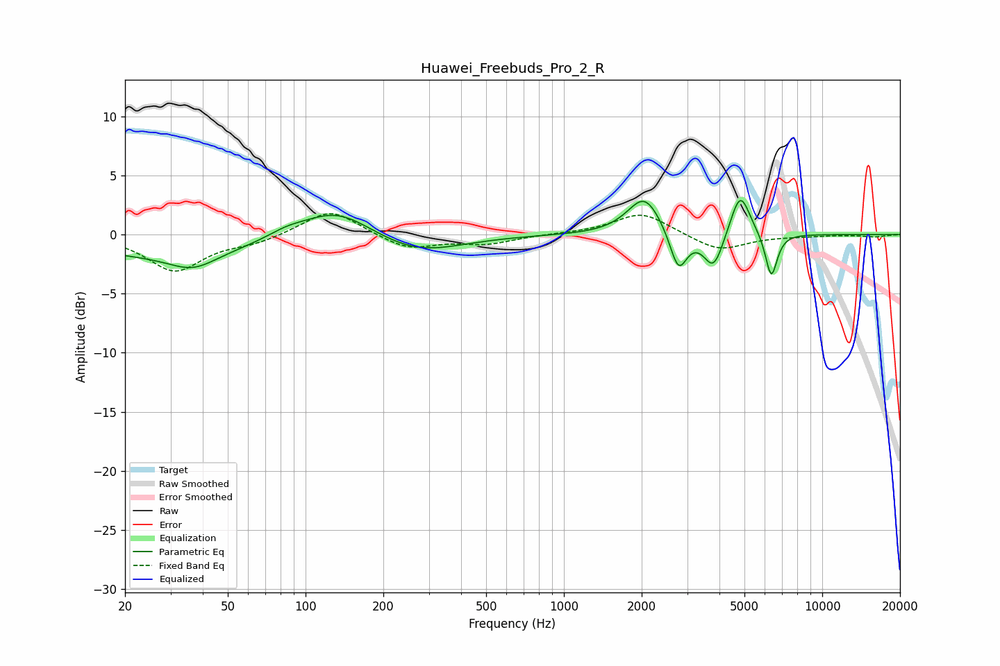

# Huawei_Freebuds_Pro_2_R
See [usage instructions](https://github.com/jaakkopasanen/AutoEq#usage) for more options and info.

### Parametric EQs
Apply preamp of -3.0 dB when using parametric equalizer.

|   # | Type    |   Fc (Hz) |    Q |   Gain (dB) |
|-----|---------|-----------|------|-------------|
|   1 | Peaking |        28 | 0.4  |        -1.7 |
|   2 | Peaking |        37 | 1.55 |        -1.4 |
|   3 | Peaking |        84 | 1.96 |         0.5 |
|   4 | Peaking |       131 | 1.02 |         2.6 |
|   5 | Peaking |       269 | 0.84 |        -1.7 |
|   6 | Peaking |      2051 | 2.18 |         3.3 |
|   7 | Peaking |      2776 | 4.29 |        -3.4 |
|   8 | Peaking |      3797 | 3.66 |        -3.1 |
|   9 | Peaking |      4812 | 3.67 |         3.8 |
|  10 | Peaking |      6350 | 5.96 |        -3.8 |

### Fixed Band EQs
When using fixed band (also called graphic) equalizer, apply preamp of **-1.9 dB** (if available) and set gains manually with these parameters.

|   # | Type    |   Fc (Hz) |    Q |   Gain (dB) |
|-----|---------|-----------|------|-------------|
|   1 | Peaking |        31 | 1.41 |        -3   |
|   2 | Peaking |        62 | 1.41 |        -0.6 |
|   3 | Peaking |       125 | 1.41 |         2.2 |
|   4 | Peaking |       250 | 1.41 |        -1.3 |
|   5 | Peaking |       500 | 1.41 |        -0.7 |
|   6 | Peaking |      1000 | 1.41 |         0   |
|   7 | Peaking |      2000 | 1.41 |         1.9 |
|   8 | Peaking |      4000 | 1.41 |        -1.4 |
|   9 | Peaking |      8000 | 1.41 |        -0.1 |
|  10 | Peaking |     16000 | 1.41 |        -0.2 |

### Graphs

