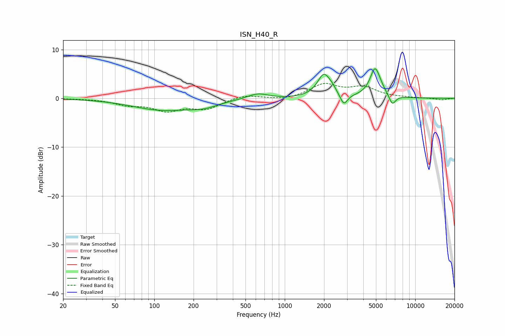

# ISN_H40_R
See [usage instructions](https://github.com/jaakkopasanen/AutoEq#usage) for more options and info.

### Parametric EQs
Apply preamp of -6.2 dB when using parametric equalizer.

|   # | Type    |   Fc (Hz) |    Q |   Gain (dB) |
|-----|---------|-----------|------|-------------|
|   1 | Peaking |       115 | 0.61 |        -2.3 |
|   2 | Peaking |       240 | 1.3  |        -1.1 |
|   3 | Peaking |       606 | 2.64 |        -0.5 |
|   4 | Peaking |       614 | 2.01 |         1.6 |
|   5 | Peaking |      1995 | 2.86 |         4.7 |
|   6 | Peaking |      2316 | 4.74 |         0.7 |
|   7 | Peaking |      2836 | 5.06 |        -2.3 |
|   8 | Peaking |      4858 | 5.96 |         1   |
|   9 | Peaking |      4975 | 3.06 |         5.2 |
|  10 | Peaking |      6672 | 5.46 |        -2.1 |

### Fixed Band EQs
When using fixed band (also called graphic) equalizer, apply preamp of **-3.2 dB** (if available) and set gains manually with these parameters.

|   # | Type    |   Fc (Hz) |    Q |   Gain (dB) |
|-----|---------|-----------|------|-------------|
|   1 | Peaking |        31 | 1.41 |        -0   |
|   2 | Peaking |        62 | 1.41 |        -1.2 |
|   3 | Peaking |       125 | 1.41 |        -2.3 |
|   4 | Peaking |       250 | 1.41 |        -2   |
|   5 | Peaking |       500 | 1.41 |         0.8 |
|   6 | Peaking |      1000 | 1.41 |        -0.4 |
|   7 | Peaking |      2000 | 1.41 |         2.7 |
|   8 | Peaking |      4000 | 1.41 |         2.1 |
|   9 | Peaking |      8000 | 1.41 |         0.1 |
|  10 | Peaking |     16000 | 1.41 |        -0.3 |

### Graphs

