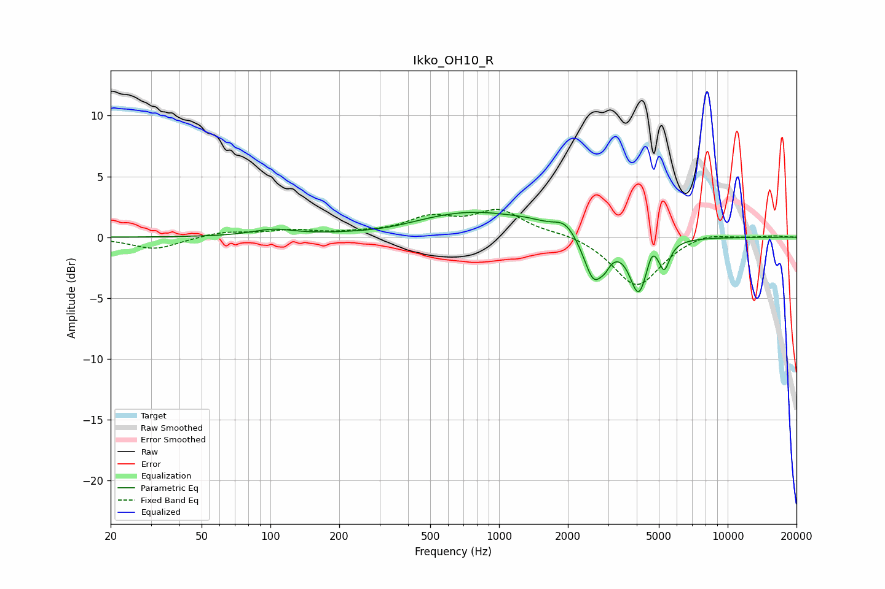

# Ikko_OH10_R
See [usage instructions](https://github.com/jaakkopasanen/AutoEq#usage) for more options and info.

### Parametric EQs
Apply preamp of -2.1 dB when using parametric equalizer.

|   # | Type    |   Fc (Hz) |    Q |   Gain (dB) |
|-----|---------|-----------|------|-------------|
|   1 | Peaking |       103 | 1.52 |         0.5 |
|   2 | Peaking |       329 | 1.18 |        -0.2 |
|   3 | Peaking |       768 | 0.53 |         2.1 |
|   4 | Peaking |      1326 | 2.03 |         0.2 |
|   5 | Peaking |      1947 | 2.98 |         1   |
|   6 | Peaking |      2592 | 3.31 |        -3.6 |
|   7 | Peaking |      2912 | 6    |        -0.7 |
|   8 | Peaking |      4085 | 3.56 |        -4.5 |
|   9 | Peaking |      4662 | 6    |         1.2 |
|  10 | Peaking |      5283 | 6    |        -2.1 |

### Fixed Band EQs
When using fixed band (also called graphic) equalizer, apply preamp of **-2.4 dB** (if available) and set gains manually with these parameters.

|   # | Type    |   Fc (Hz) |    Q |   Gain (dB) |
|-----|---------|-----------|------|-------------|
|   1 | Peaking |        31 | 1.41 |        -1   |
|   2 | Peaking |        62 | 1.41 |         0.4 |
|   3 | Peaking |       125 | 1.41 |         0.5 |
|   4 | Peaking |       250 | 1.41 |         0.2 |
|   5 | Peaking |       500 | 1.41 |         1.4 |
|   6 | Peaking |      1000 | 1.41 |         2.1 |
|   7 | Peaking |      2000 | 1.41 |         0.3 |
|   8 | Peaking |      4000 | 1.41 |        -4.1 |
|   9 | Peaking |      8000 | 1.41 |         0.5 |
|  10 | Peaking |     16000 | 1.41 |         0.1 |

### Graphs

