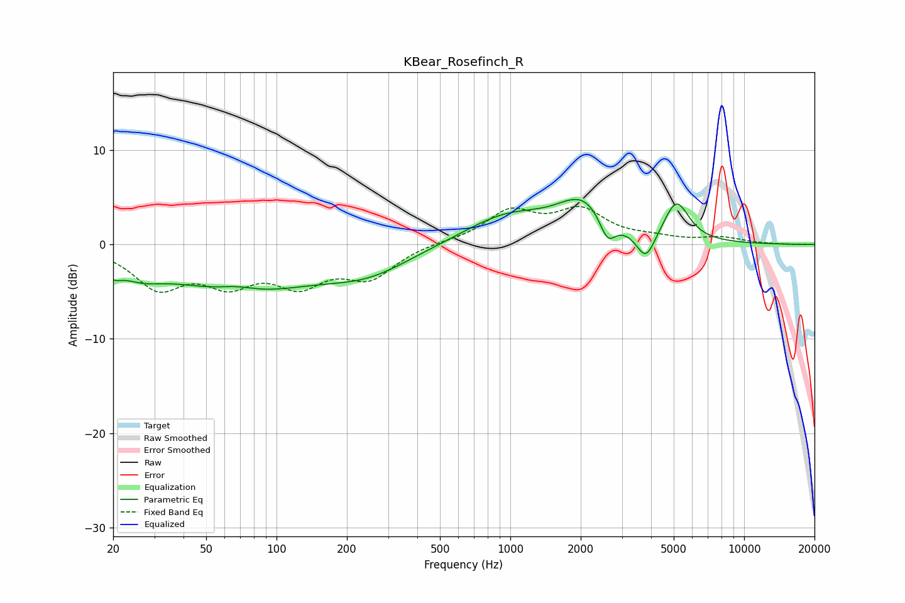

# KBear_Rosefinch_R
See [usage instructions](https://github.com/jaakkopasanen/AutoEq#usage) for more options and info.

### Parametric EQs
Apply preamp of -4.9 dB when using parametric equalizer.

|   # | Type    |   Fc (Hz) |    Q |   Gain (dB) |
|-----|---------|-----------|------|-------------|
|   1 | Peaking |        20 | 4.22 |        -1.1 |
|   2 | Peaking |        26 | 1.4  |        -1.7 |
|   3 | Peaking |        68 | 1.74 |         0.7 |
|   4 | Peaking |        70 | 0.45 |        -4.7 |
|   5 | Peaking |       247 | 0.76 |        -2.4 |
|   6 | Peaking |       964 | 0.77 |         3   |
|   7 | Peaking |      2056 | 1.27 |         4.1 |
|   8 | Peaking |      2605 | 4.05 |        -2.7 |
|   9 | Peaking |      3798 | 3.45 |        -3.1 |
|  10 | Peaking |      5136 | 2.61 |         4.2 |

### Fixed Band EQs
When using fixed band (also called graphic) equalizer, apply preamp of **-4.1 dB** (if available) and set gains manually with these parameters.

|   # | Type    |   Fc (Hz) |    Q |   Gain (dB) |
|-----|---------|-----------|------|-------------|
|   1 | Peaking |        31 | 1.41 |        -4.2 |
|   2 | Peaking |        62 | 1.41 |        -3.5 |
|   3 | Peaking |       125 | 1.41 |        -3.7 |
|   4 | Peaking |       250 | 1.41 |        -3.2 |
|   5 | Peaking |       500 | 1.41 |         0.2 |
|   6 | Peaking |      1000 | 1.41 |         3.3 |
|   7 | Peaking |      2000 | 1.41 |         3.3 |
|   8 | Peaking |      4000 | 1.41 |         0.5 |
|   9 | Peaking |      8000 | 1.41 |         0.7 |
|  10 | Peaking |     16000 | 1.41 |        -0   |

### Graphs

