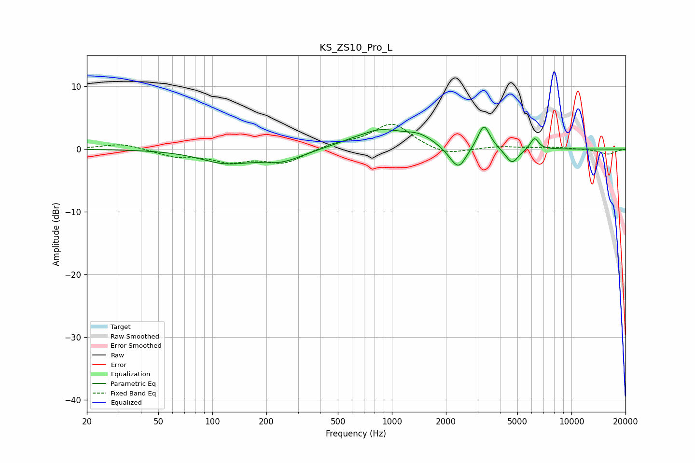

# KS_ZS10_Pro_L
See [usage instructions](https://github.com/jaakkopasanen/AutoEq#usage) for more options and info.

### Parametric EQs
Apply preamp of -3.6 dB when using parametric equalizer.

|   # | Type    |   Fc (Hz) |    Q |   Gain (dB) |
|-----|---------|-----------|------|-------------|
|   1 | Peaking |       117 | 1.01 |        -2   |
|   2 | Peaking |       242 | 1.16 |        -1.8 |
|   3 | Peaking |       698 | 3.58 |        -0.2 |
|   4 | Peaking |       835 | 0.97 |         3   |
|   5 | Peaking |      1418 | 1.78 |         1.4 |
|   6 | Peaking |      2163 | 2.97 |        -0.9 |
|   7 | Peaking |      2368 | 3.45 |        -3   |
|   8 | Peaking |      3254 | 4.23 |         4   |
|   9 | Peaking |      4666 | 3.89 |        -2.5 |
|  10 | Peaking |      6223 | 6    |         1.9 |

### Fixed Band EQs
When using fixed band (also called graphic) equalizer, apply preamp of **-4.1 dB** (if available) and set gains manually with these parameters.

|   # | Type    |   Fc (Hz) |    Q |   Gain (dB) |
|-----|---------|-----------|------|-------------|
|   1 | Peaking |        31 | 1.41 |         0.9 |
|   2 | Peaking |        62 | 1.41 |        -1.1 |
|   3 | Peaking |       125 | 1.41 |        -1.8 |
|   4 | Peaking |       250 | 1.41 |        -2.2 |
|   5 | Peaking |       500 | 1.41 |         0.8 |
|   6 | Peaking |      1000 | 1.41 |         4.1 |
|   7 | Peaking |      2000 | 1.41 |        -1.1 |
|   8 | Peaking |      4000 | 1.41 |         0.4 |
|   9 | Peaking |      8000 | 1.41 |         0.3 |
|  10 | Peaking |     16000 | 1.41 |        -0.8 |

### Graphs

